This was the first real overseas test: could I fly a bike to one city, cycle across a country, and fly home from somewhere else? If it worked, I could start planning much bigger trips.

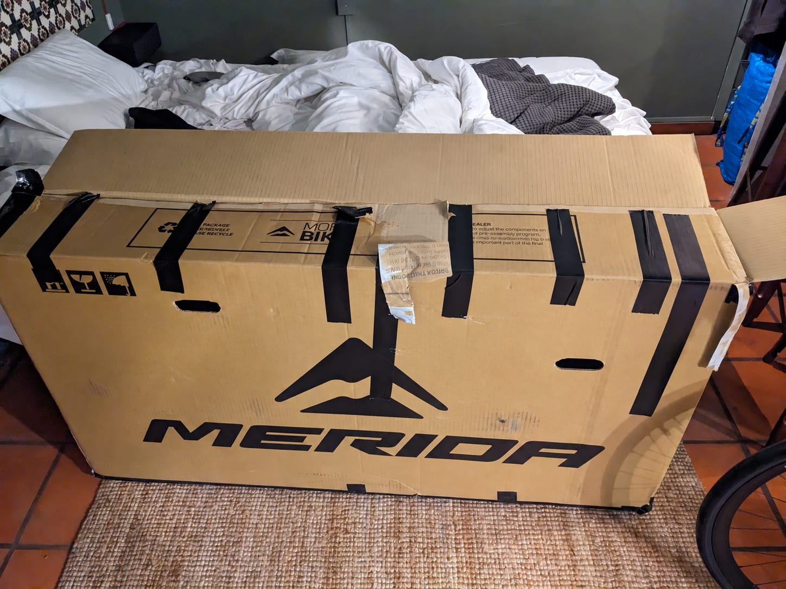

It was my first time in Portugal too, so double excitement 🙂 I'd made a few advancements in my planning. I had UV arm warmers ready for brutal weather, although thankfully most of the trip was mild. I'd also started marking possible food stops as waypoints, so I could see how long it was until the next feed and plan my effort in real time. Additionally, and thankfully, this wasn't a "working holiday", so there was no laptop in the bags.

## A few days in Porto

I'd built a few days in Porto into the plan. They gave me time to see the city and a buffer in case the bike needed attention after the flight. Thankfully, it didn't.

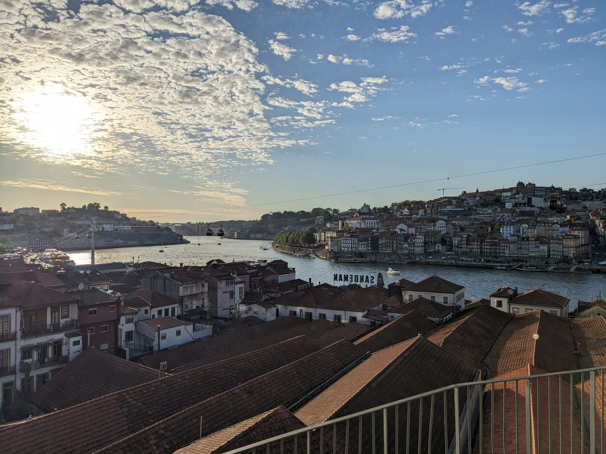

The first spin was a taster ride to learn the roads and drivers. My first thought was instantly: "They do give lots of space for overtakes, but they're pretty risky and fast about it!" I didn't have any real trouble throughout the trip, but it was interesting how aggressive some drivers were while still giving lots of space.

## Day 1: Porto to Figueira da Foz

The first official day, from Porto to Figueira da Foz, started with great cycling infrastructure and really quiet roads.

I was making good time for the São Jacinto–Forte da Barra ferry until I stopped to help a local with a puncture. He was struggling to get the tyre off, then the pump he had for the new tube was really bad. I took out my pretty nice semi-track pump and got it inflated in no time. That put me under time pressure, so the rest of the ride to the ferry was much faster than planned. But a good deed is a good deed 🙂

Near the end of the day, I realised my brake pads were totally worn out. Why didn't I replace them before the trip? The front brake was weak and sounded awful, but I'd at least brought spare pads. I thought I'd fix them in the hotel and carry on.

Then I discovered that none of my tools would work. I needed a flathead screwdriver and my multi-tool didn't have one. Big panic. Thankfully, the place I was staying doubled as a bike rental shop. Reception instantly found a screwdriver, the fresh pads went in, and I was sorted. There was a bit of disc rub, but that's better than no brakes at all.

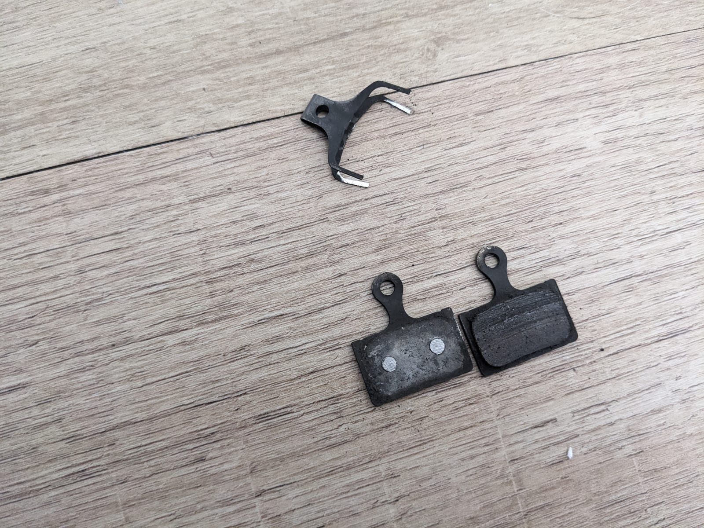

## Day 2: Figueira da Foz to Caldas da Rainha

Day 2, from Figueira da Foz to Caldas da Rainha, had some of the worst roads and the best views of the whole trip. There were miles of potholes where I could ride faster than the cars because they were bouncing through the holes. I'd studied Street View as far as it went and checked satellite imagery, so I knew the road was coming. It was still much worse than expected.

Shortly after, I was back on good tarmac and cycle paths.

Then there was a peaceful view of the Atlantic.

Then: views, oh my views.

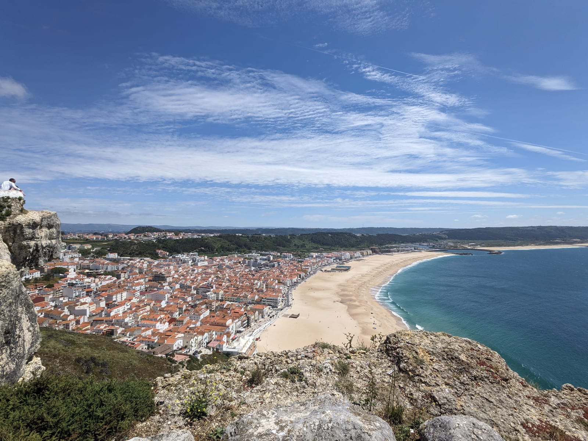

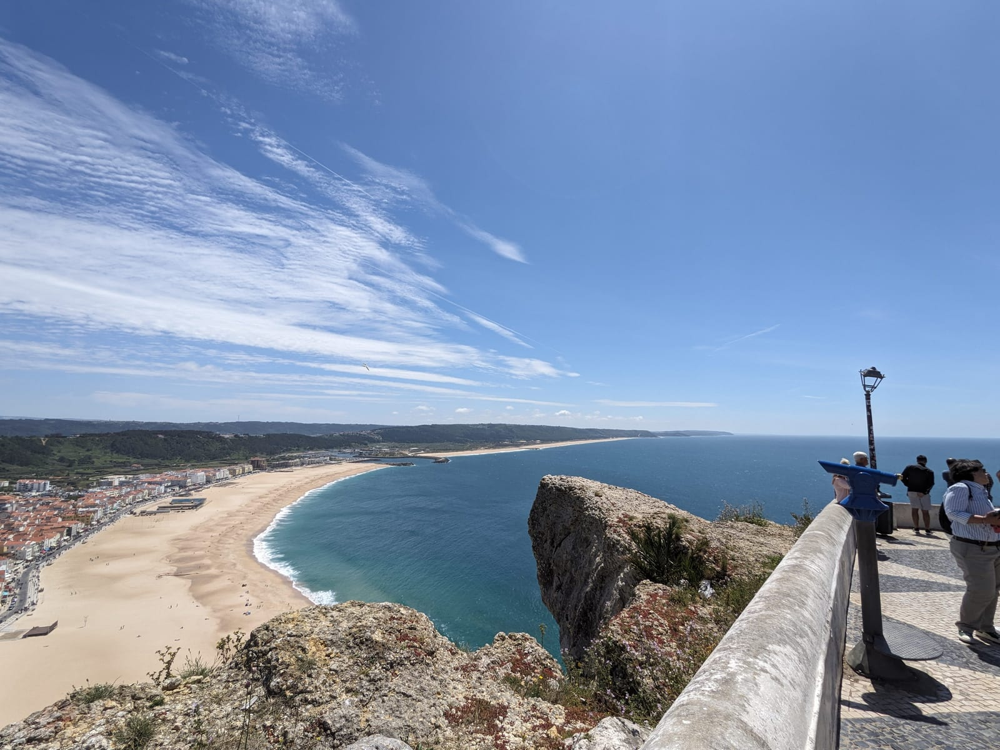

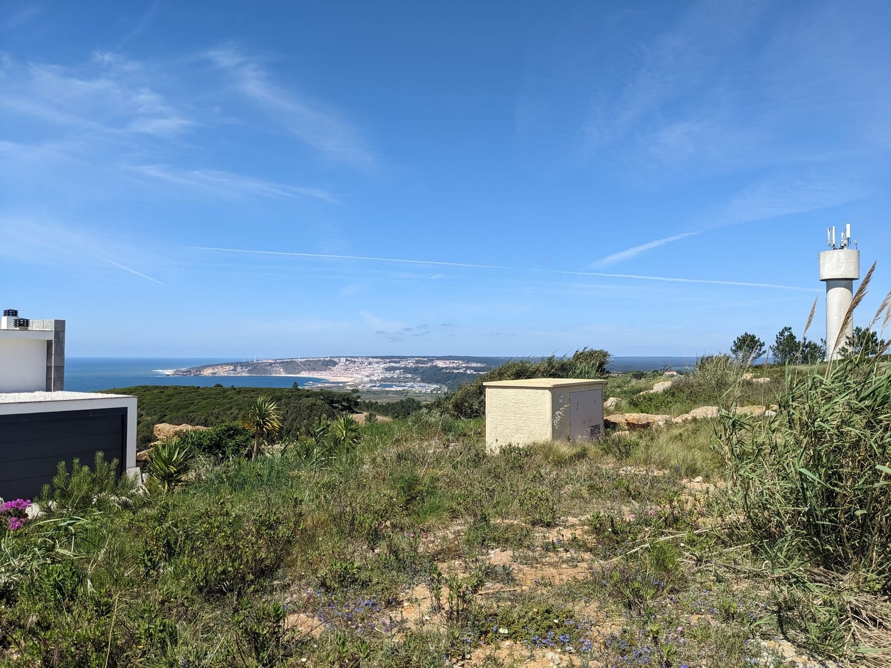

## Day 3: Caldas da Rainha to Lisbon

Day 3 took me from Caldas da Rainha into Lisbon. I'd been worried about the approach: busy main roads, plus steep hills on the alternatives. In the end it was a decent day with no big issues, although I didn't record much because I was concentrating on staying safe 🙂

I did acquire a love for Sumol along the way.

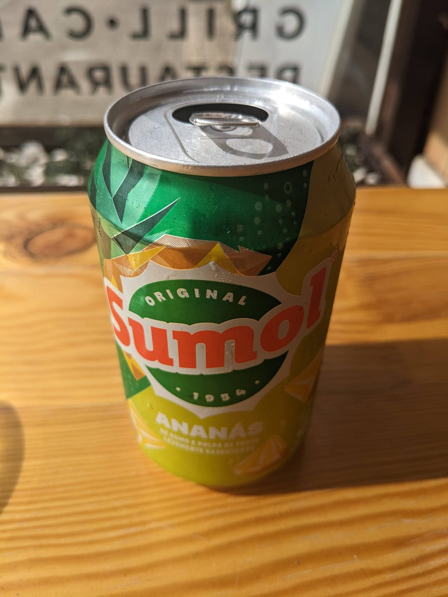

That evening I treated myself to the usual staple of Korean food and 막걸리.

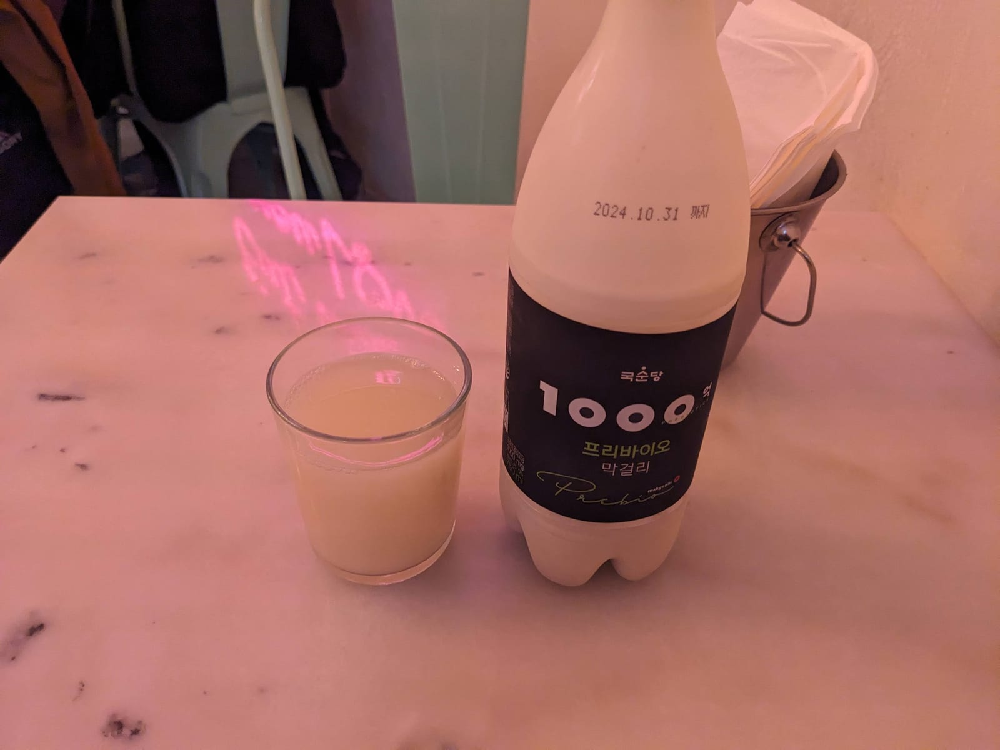

I also made a quick trip to a bike shop because my thru-axle was pretty worn out. If I got a puncture, there was a risk I wouldn't get the wheel back on after removing it. Sadly, the shop didn't have a replacement.

## A Lisbon side quest

I had a few days' break in Lisbon, but I'd planned a 138 km (86 miles) side quest up the west coast, including a long climb up a proper hill without the bags. My legs weren't really feeling it and the weather was dull and windy. Still, it was type 2 fun and I'm glad I did it. It's hard to get sick of seeing the sea.

## Day 4: Lisbon to Vila Nova de Milfontes

I couldn't stay in Lisbon forever. Day 4 began with not one, but two ferries: Lisbon to Seixal, then Setúbal to Tróia 🙂

South of Lisbon, before the mighty Algarve, it was very quiet, nearly peaceful. It was a great place to cycle on the way to Vila Nova de Milfontes.

## Day 5: Vila Nova de Milfontes to Faro

The last day took me from Vila Nova de Milfontes to Faro.

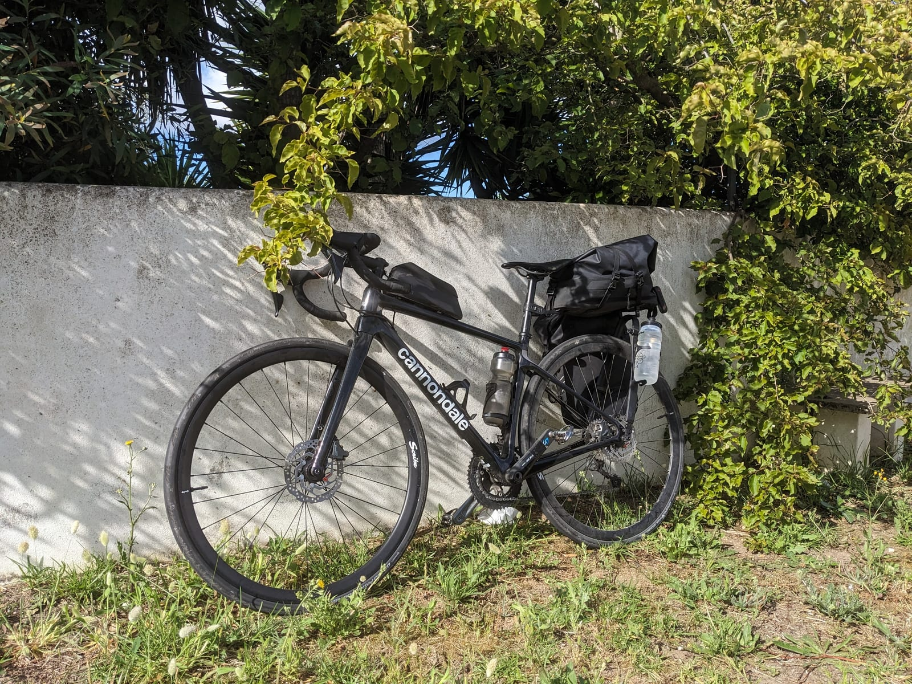

This was the big climbing day, through the mountains to reach the southern coast. There were some mega climbs and incredible views, even if the photos don't really do them justice.

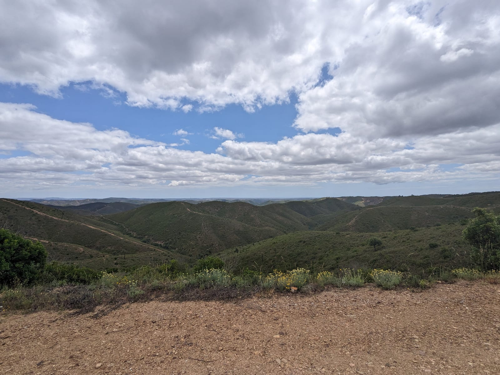

The roads were also extremely dusty.

But I got it done. Then came the excitement of finding another bike box for the flight home. I'd emailed a bike shop beforehand, but when I arrived they didn't know I was coming even though they'd replied. Then they charged me €20 for the box. It's not as if I could say no 🙁

Though the sting of paying so much for a cardboard box was reduced by finding a bar with the old PS1 classic Micro Machines available to play!

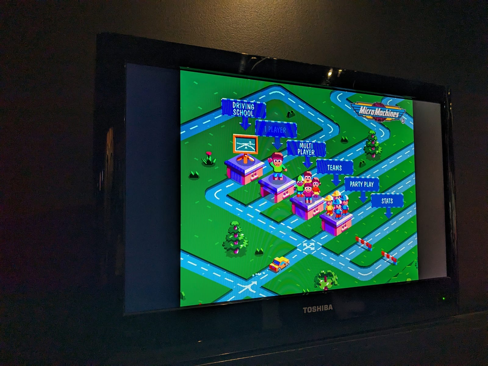

## A successful test

It worked. I could fly in and out on a trip and manage somewhere without speaking the language.

My photos and videos still needed work. They were a bit crap, but I packed well and managed the mileage well for such a short trip. Overall, a very successful trip.
