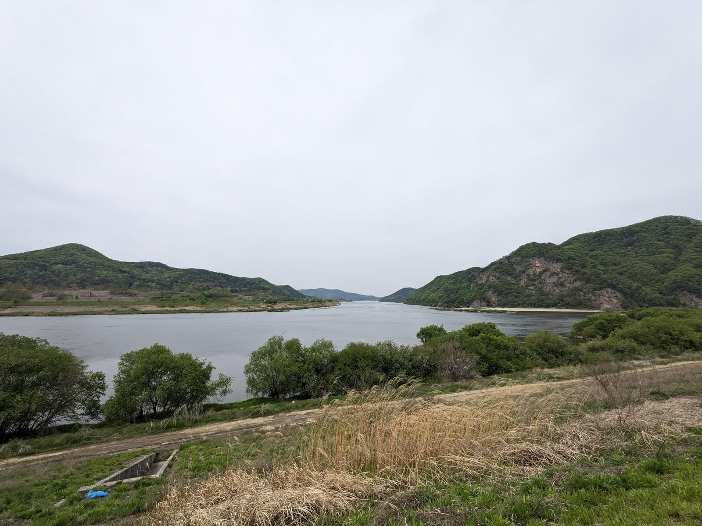
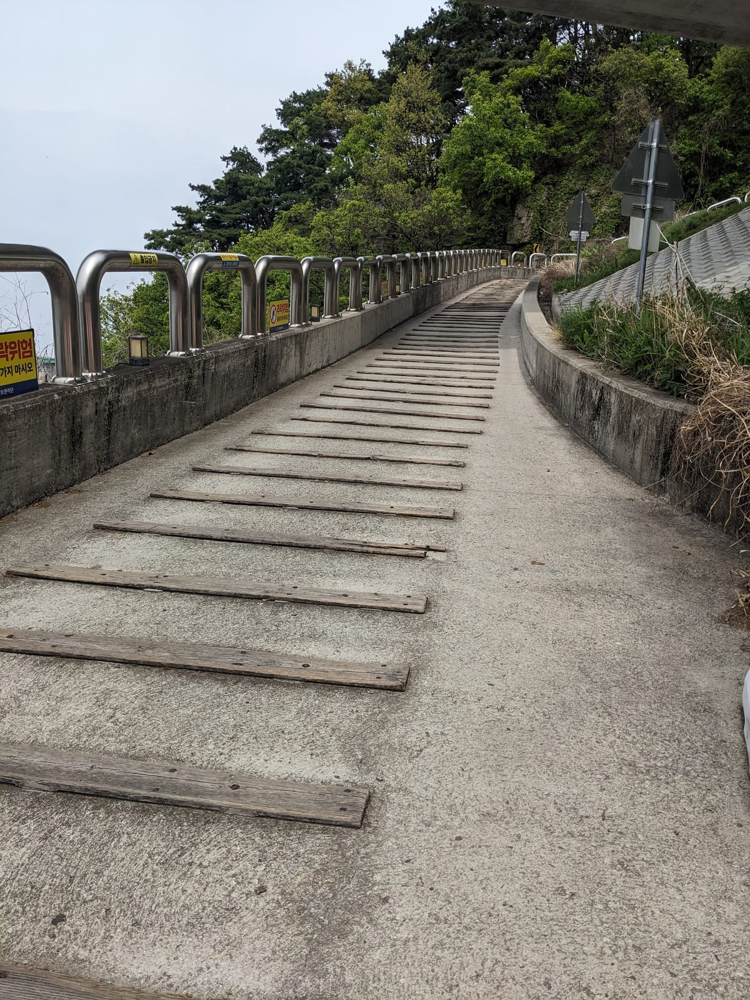
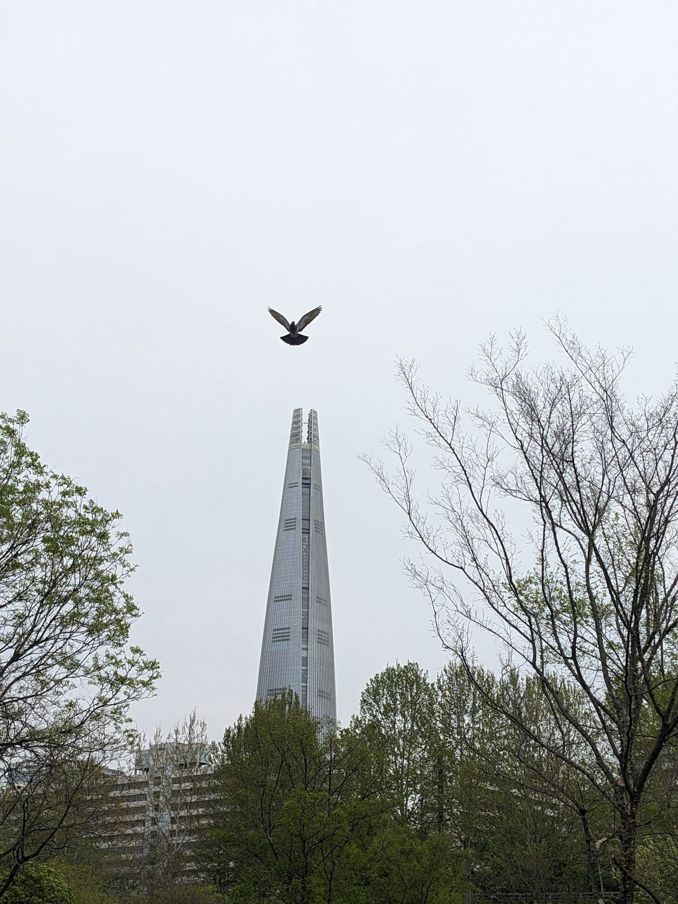
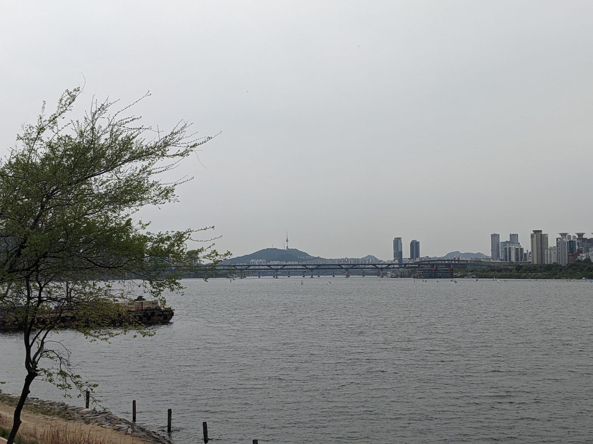
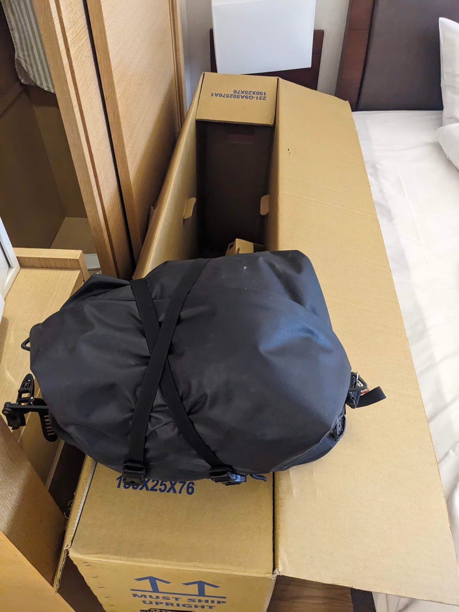
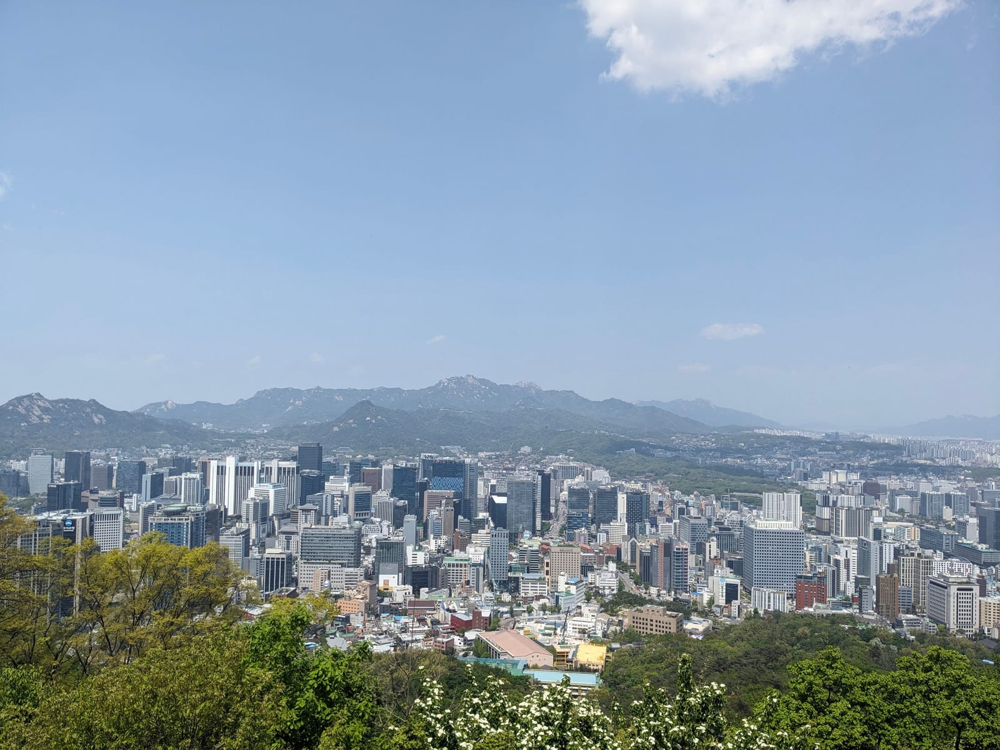
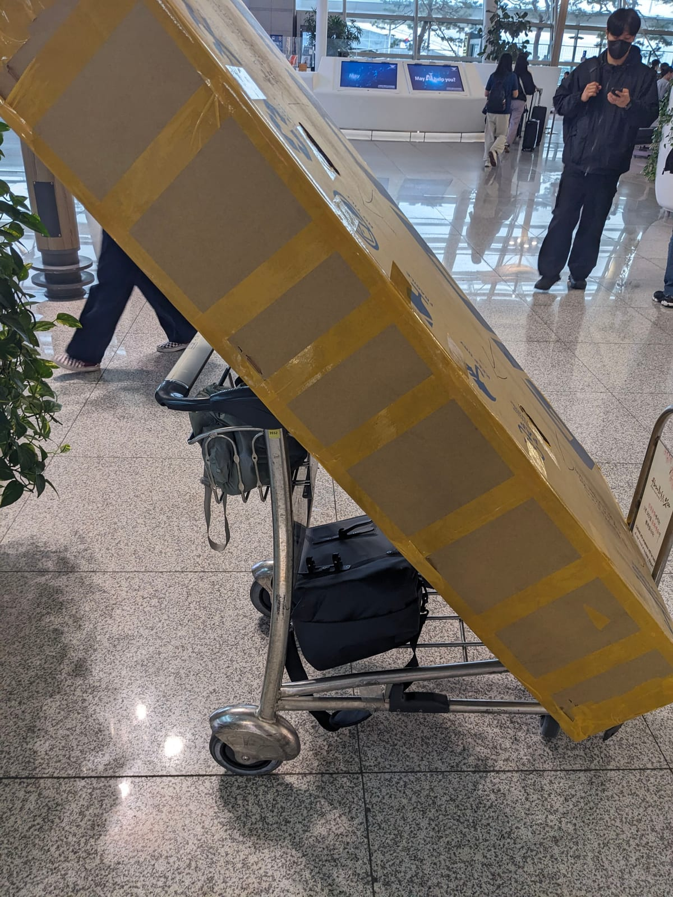

## Into Seoul

On to the last day of Korea, and of the trip. As it was the last day, I decided I could put a bit more effort in, not as if I needed to save the legs. It was a bit longer, but I knew the ride into Seoul would be on amazing cycle lanes, so why not go for it? Not that I just put my head down and time-trialled it; I still wanted to enjoy it.

So many bridges along the way, always delightful even the old ones.

I did have a minor issue: I was racing up to the top of a bridge, as they can sometimes be steep, and didn't notice all the steps on the ascent. So I rolled over a few before I nearly got bounced off the bike. Thankfully no damage to the bike, or me for that matter. Just laughed it off and started walking up.

Then, finally, arriving in Seoul.

I swear seeing it appear was a feeling of coming home, a bit, for me. I've been here I think three times before, one of them living here for nearly half a year, so I really love this city.

Only thing left to do was retrieve a box for the bike (I'd emailed a local bike shop near my hotel months before, so they knew I was coming and were super helpful!), enjoy a few days in Seoul, and get on a plane home.

What an amazing trip. Perhaps impossible to ever beat, and I'm so glad I did it. It was a huge amount of work to plan, a big chunk of investment to do, but my god was it amazing. And all my previous trips really added up here: so little went wrong, I had backup plans in place when it did, and I could really just enjoy it. I'll never get enough of amazing views of mountains and rivers, I will 100% need to go back to both countries for more cycling trips!
