## The last days in Japan

My final day cycling in Japan with a fully loaded bike (though not the last official cycling day 😉). At this point it was starting to sink in that my cycle through Japan was coming to an end, so I was trying to soak it in as much as possible.

One thing I haven't mentioned is all the train tracks you have to navigate! Japan is famous for its train services, not just often and on time but spread out everywhere, so you cross the tracks quite often. I noticed the behaviours are quite different from Europe: everyone stops at the crossing and looks both ways, even with the gate already open; there's no big rush on the barrier opening, perhaps because everyone stops to check anyway; and everyone comes to a stop on the barrier closing, in a very relaxed manner. It's a habit I've kind of adopted, though it's slowly disappearing now I'm out with my cycling club and no one else is doing it, so a bit dangerous for me to suddenly stop or slow down 😅. It's interesting that a country so locked into trains still has this safety habit embedded in all its drivers.

After arriving at my hotel for the next two nights, there was, weirdly, a tower that looked like a bit of a disco ball. So obviously I wanted to go to the top, and there I got a view of the ferry I'd be jumping on in a few days.

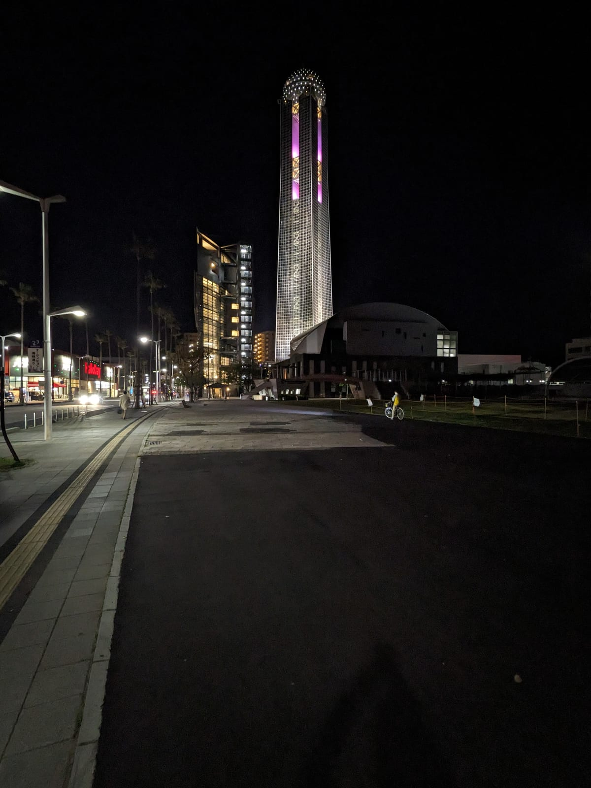

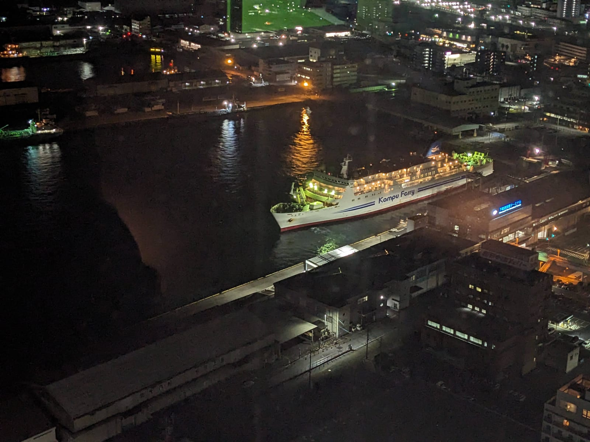

But cycling in Japan isn't quite done yet. My initial plan was to cycle from Tokyo to Fukuoka and get the fast boat from there, but for a few months, right when I was doing the trip, the fast boat from Fukuoka was under maintenance, and there were no other ferries to Busan from there either. So the plan was dead, and instead I needed the slow boat from Shimonoseki. That didn't stop me wanting to "complete" the trip to Fukuoka, though, and it meant I'd hit three of the four main Japanese islands.

So onto the bullet train, to do a bit of a reverse of the last day I was going to do.

Sure, it's way faster. But nowhere near as fun as cycling. With no bags with me, I'd planned a bit of a hilly return to Shimonoseki: up to a shrine to see a big statue, up a dam, through the hills, and back down through a tunnel to Honshu.

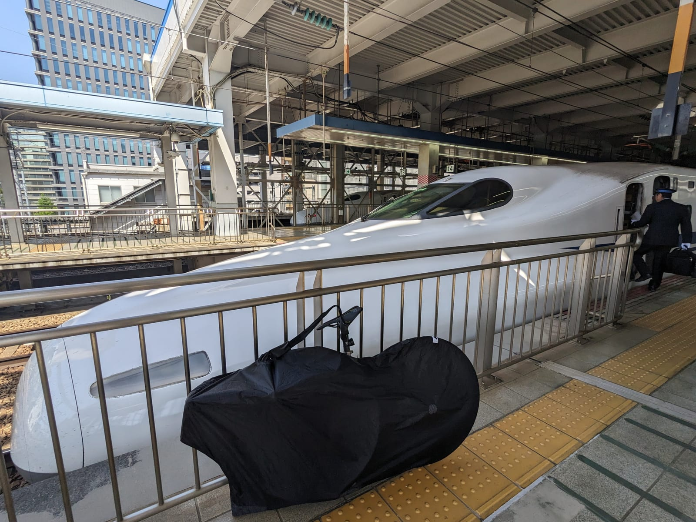

Art does mirror life at times.

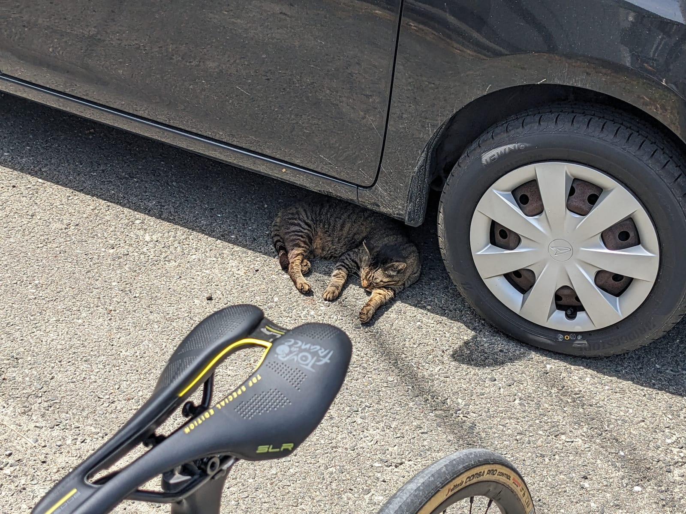

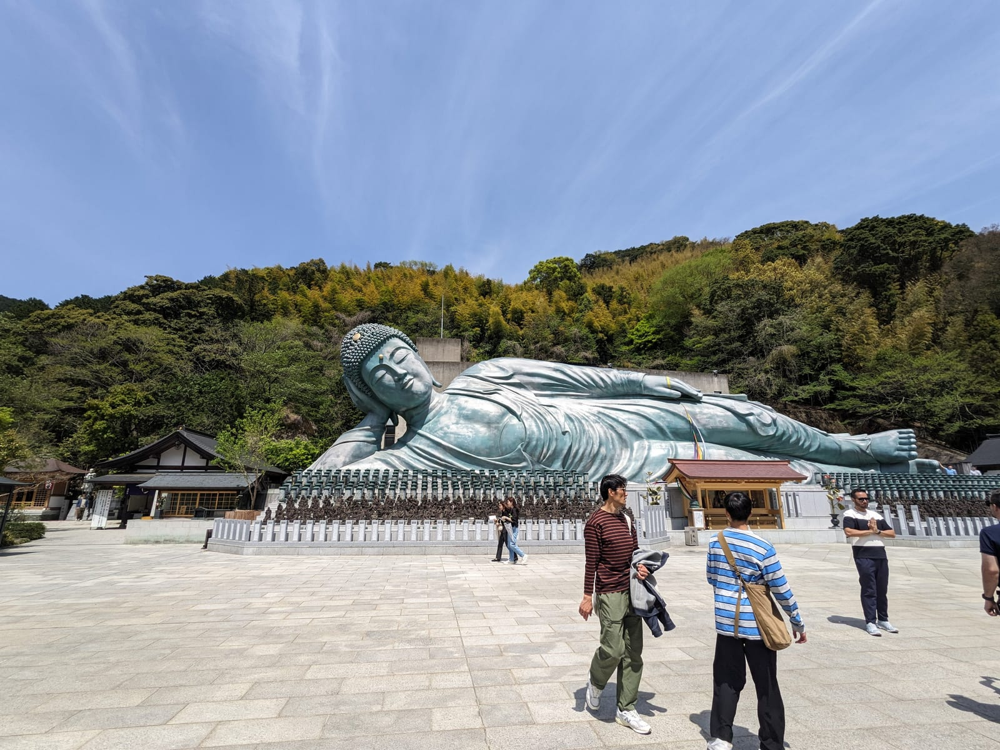

Then up the dam, for a pretty sweet view. The temperature had really ramped up today, too. It's weird thinking I started my trip at around 8 degrees, and now I was hitting around 37. The seasons really do flip quickly in Japan.

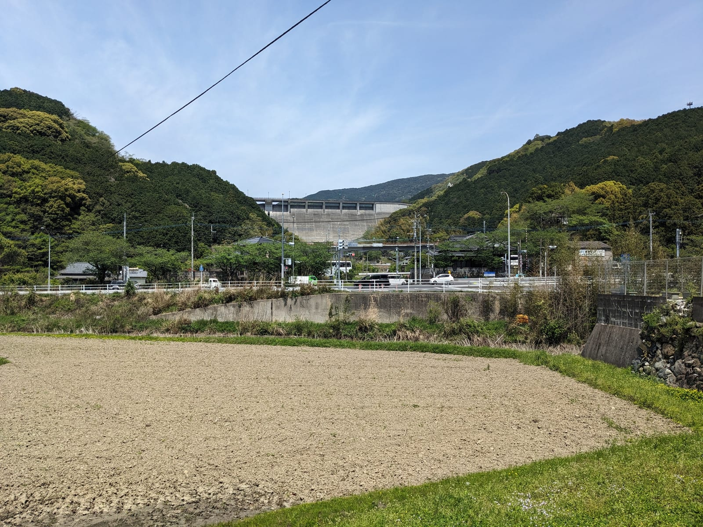

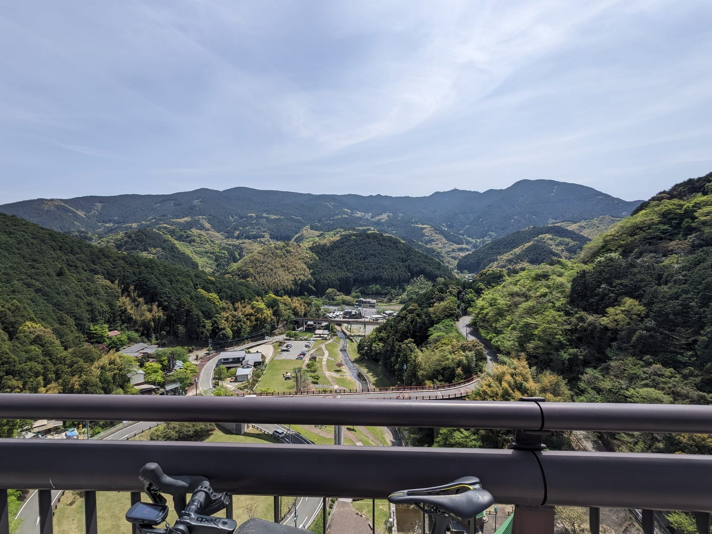

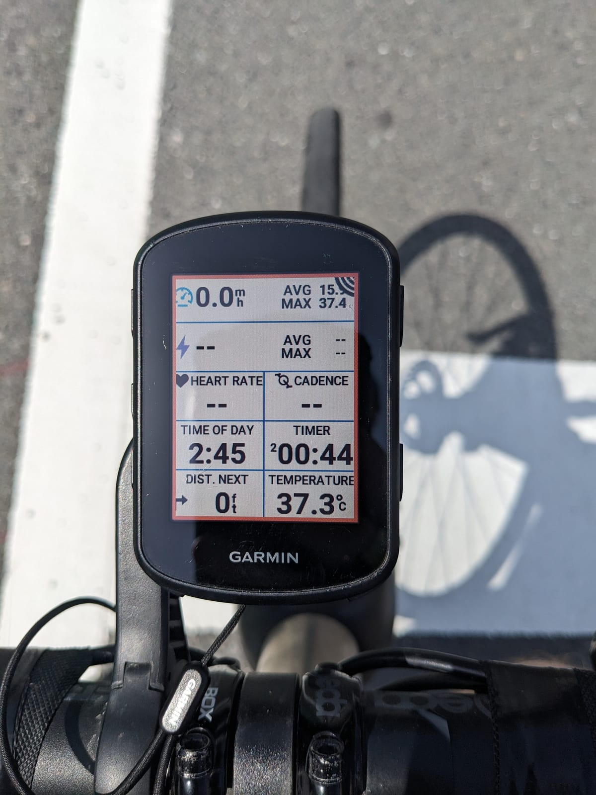

I was really feeling the "last day in Japan", so while the cycle was incredible, it was melancholy. I'll just have to come back, won't I?

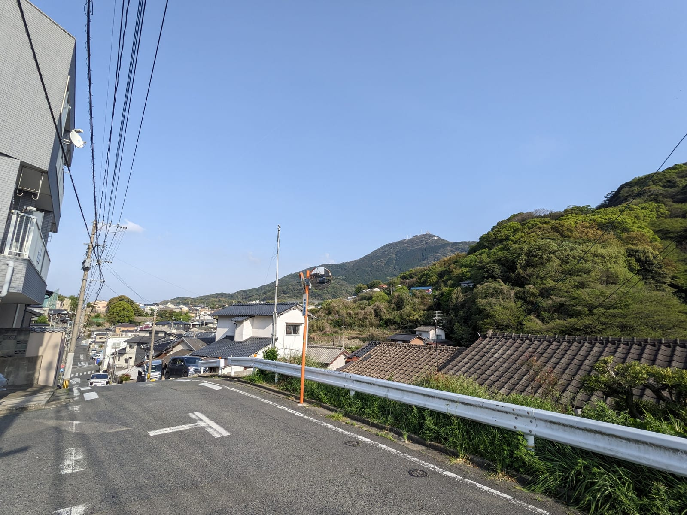

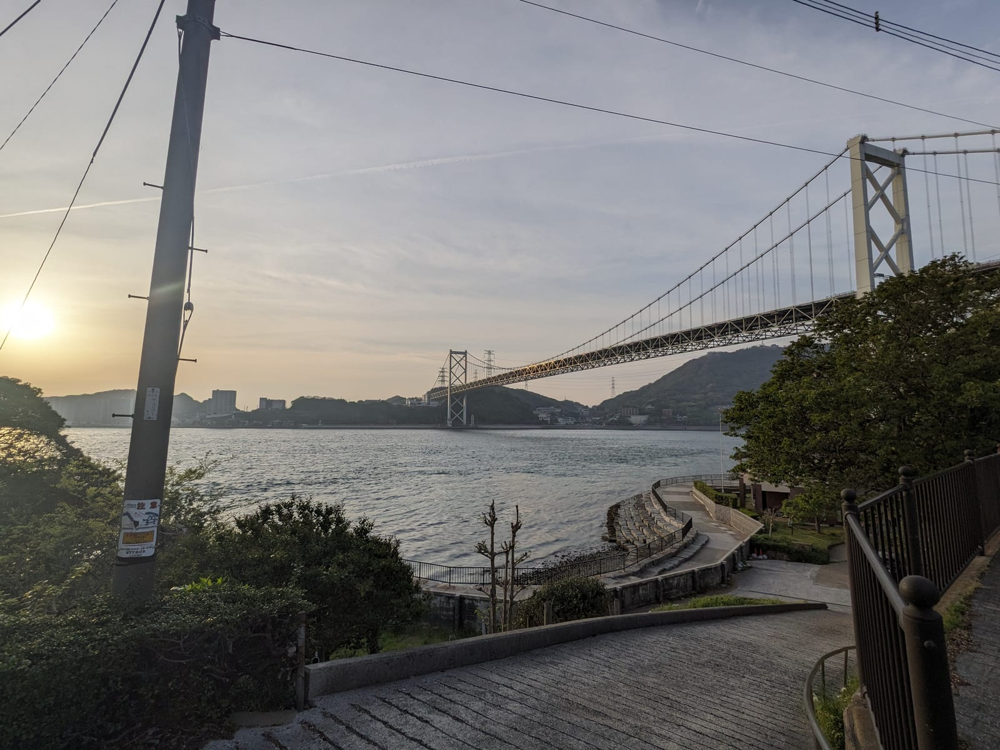

I nearly didn't want to go back and end it! But one last tunnel back to Honshu.

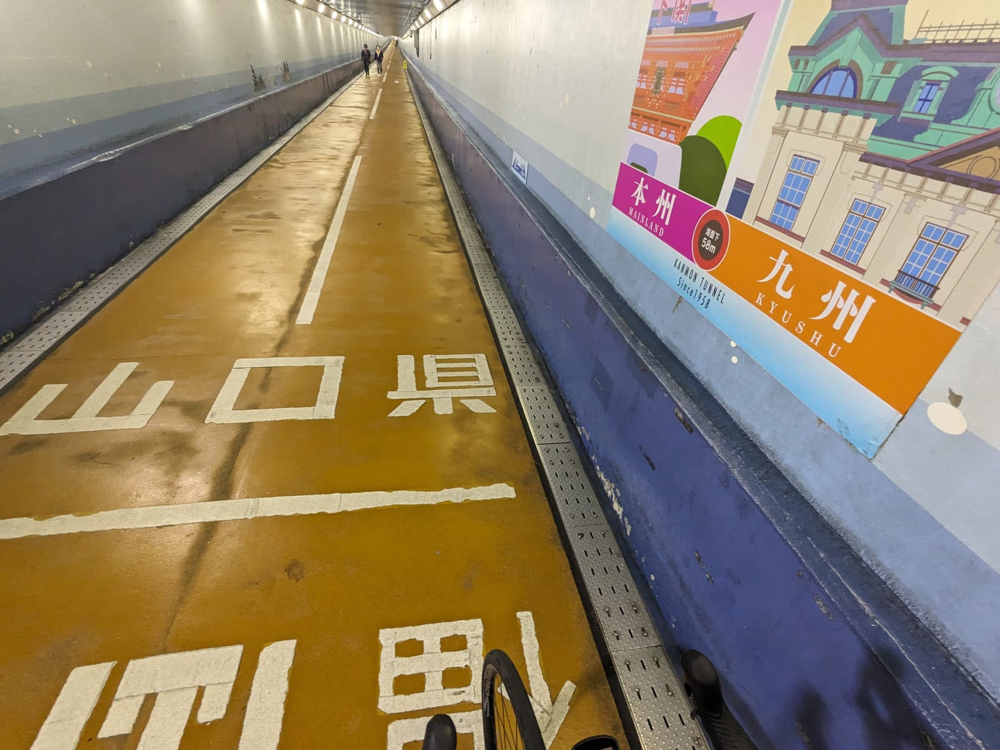

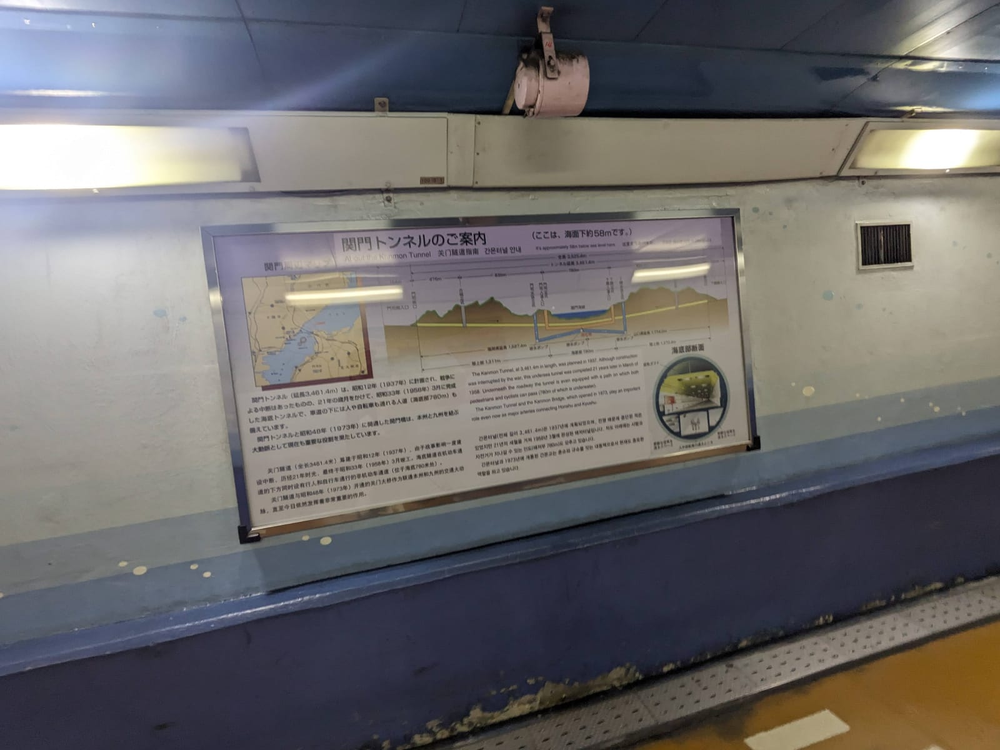
