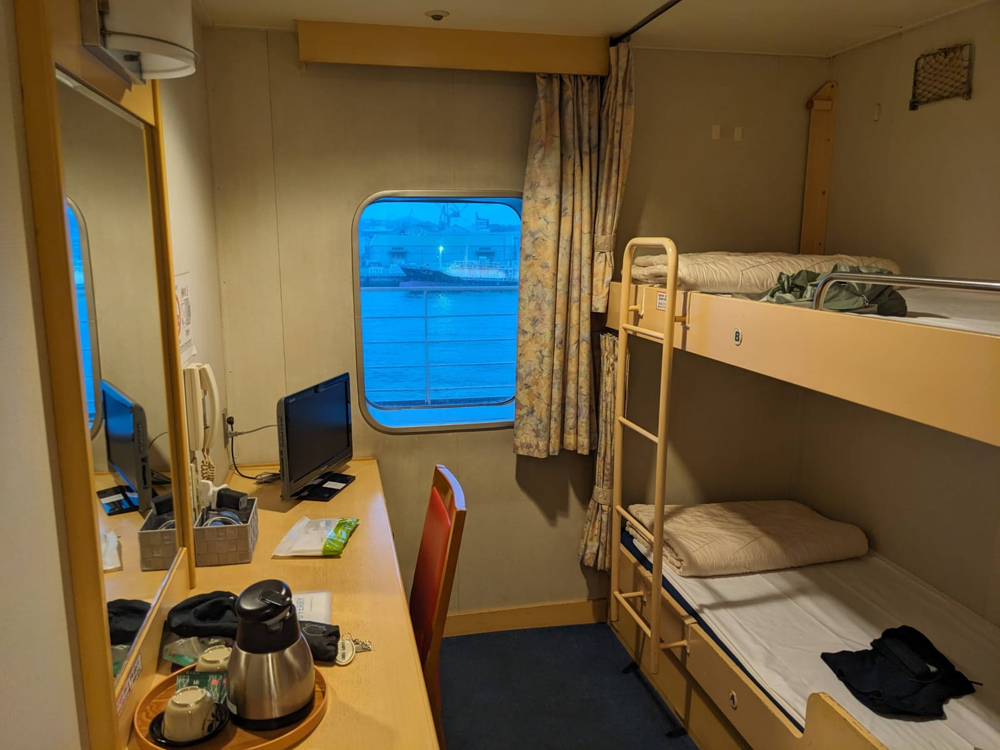
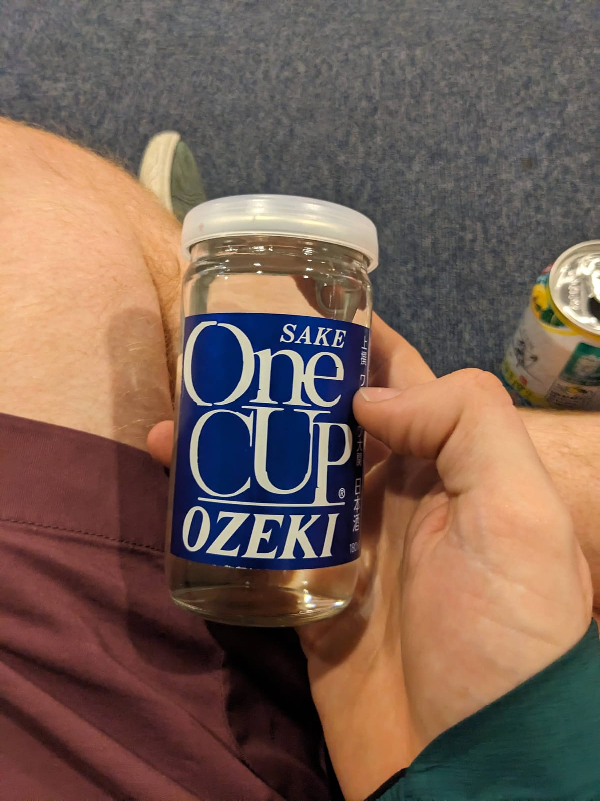
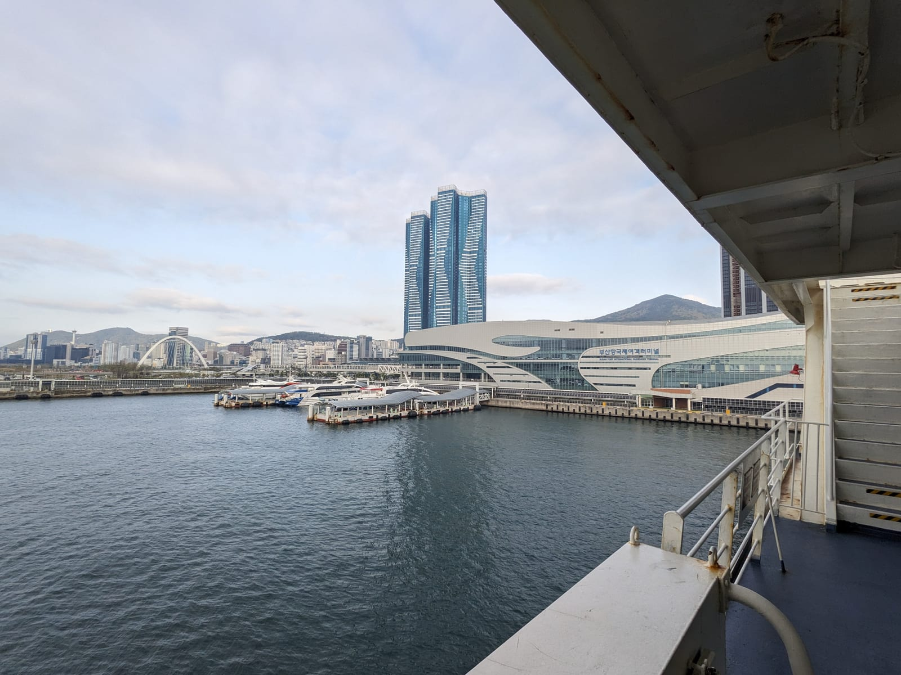
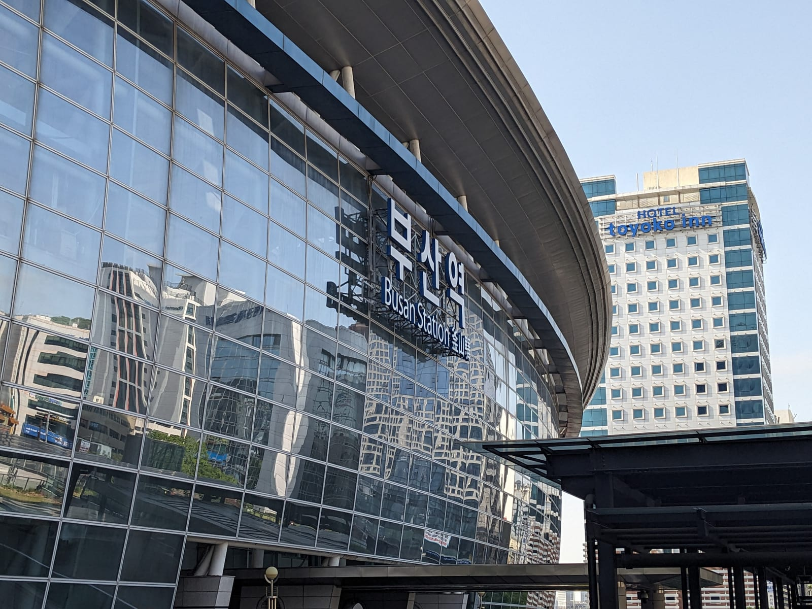
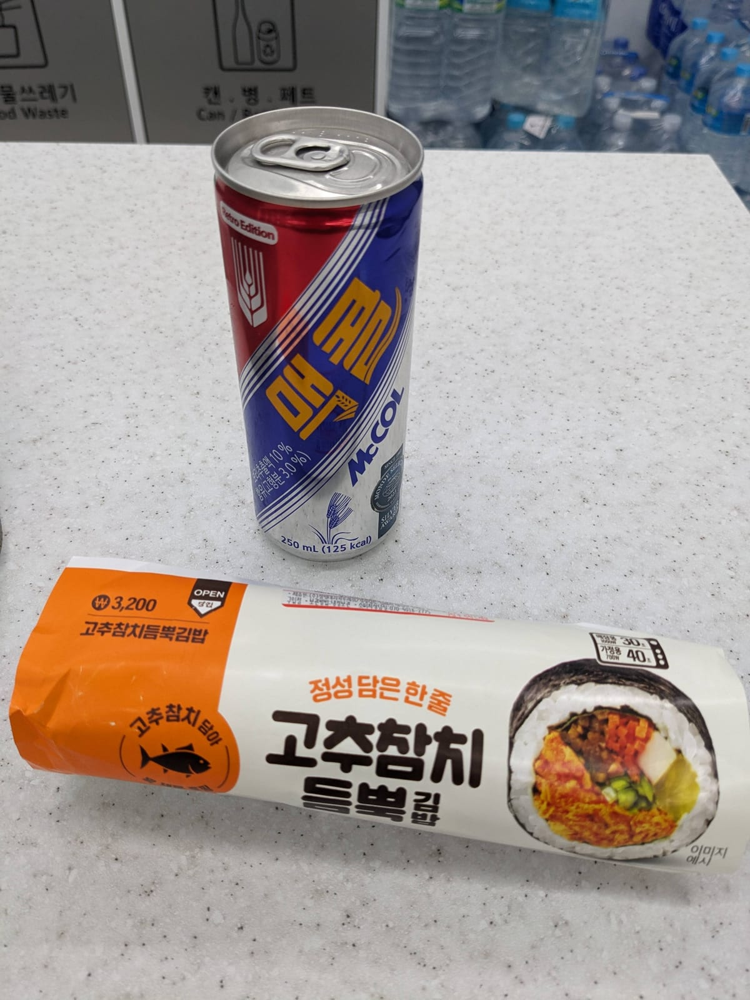
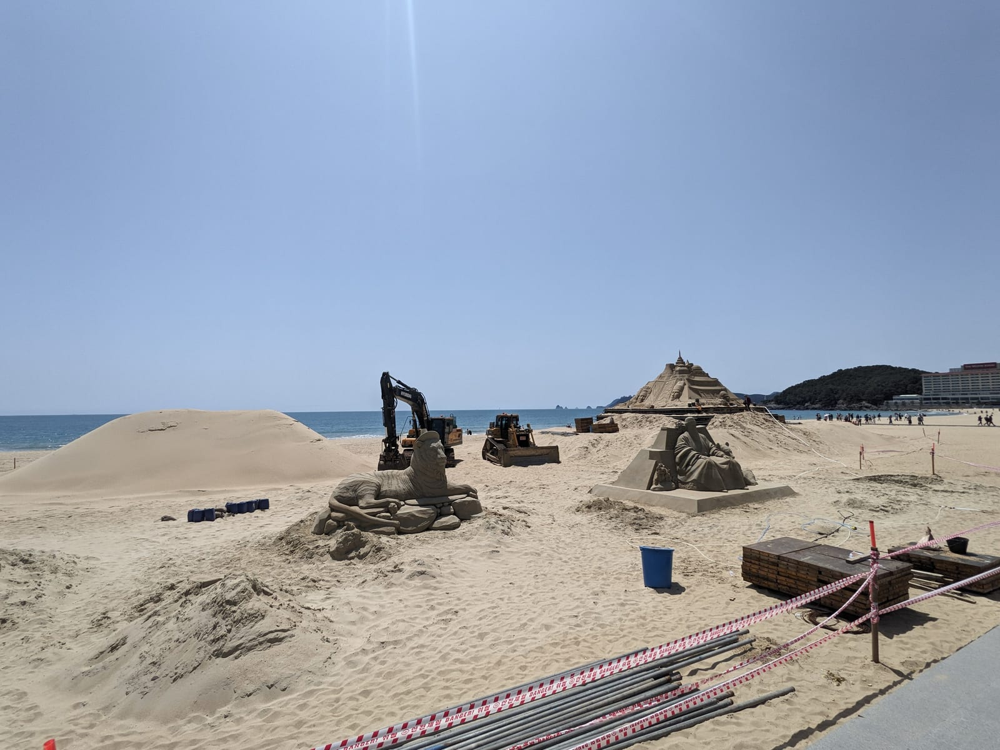
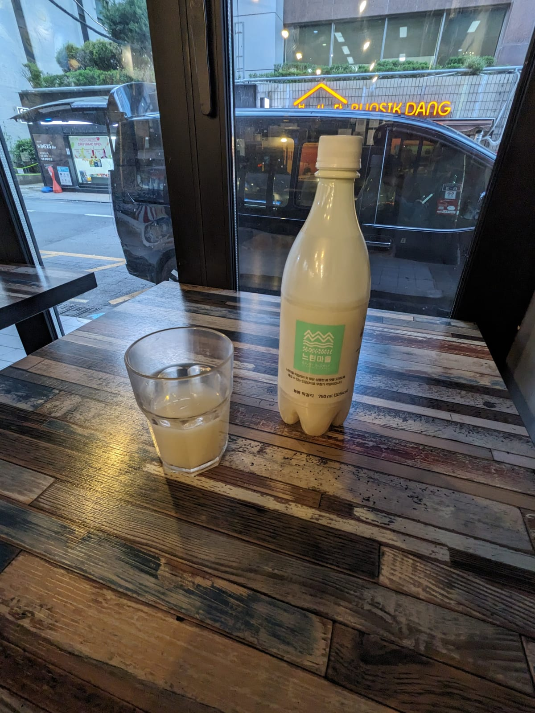
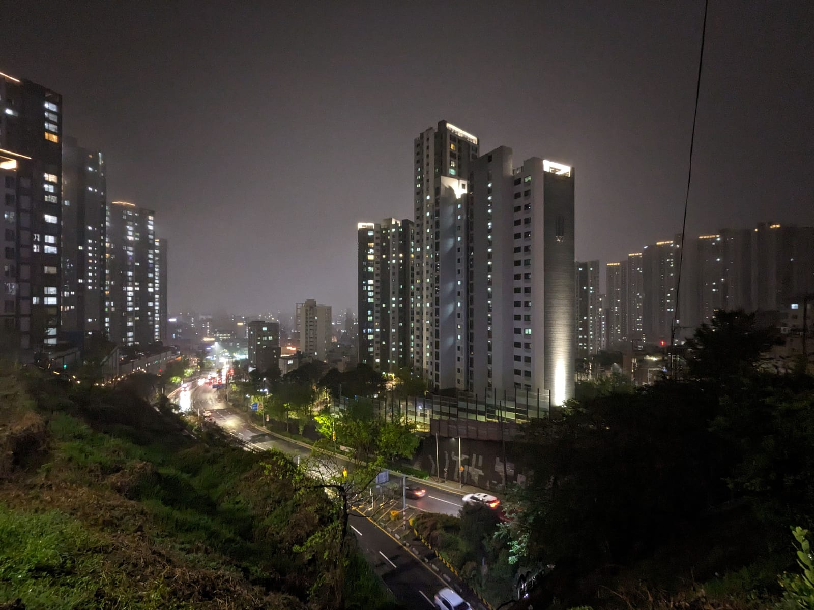
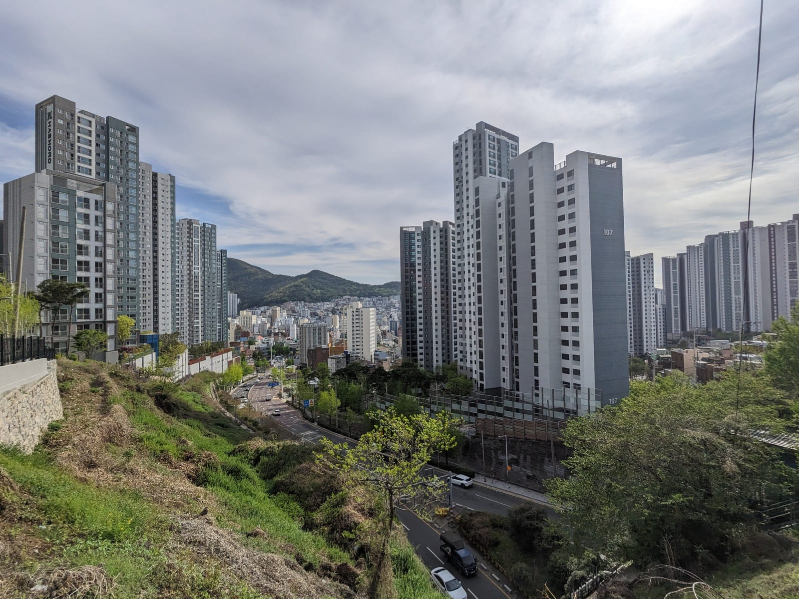

## The ferry to Korea

Tomorrow, off to Korea. The ferry even had a TV in the cabin, so strange. It left pretty late in the evening. But I got to enjoy drinking with some Koreans on the way over, and practise my Korean.

## Busan

The nice thing about this leg is that I can actually speak a bit of Korean. Sadly in Japan my Japanese was very, very little (I did try to learn some, but I guess it was a struggle!), however in Korea I can at least hold a simple conversation and have a bit of banter with people, so a bit less isolating.

I did get a bit lost trying to get off the ferry, but I'll perhaps blame that on the sake, beer, and soju from the crossing.

I had my favourite Korean soft drink and lunch, enjoyed the beach, and of course, some makgeolli.

I had another day off in Busan, so I just relaxed and went on some long walks around the town. I also did a bit of tactical scouting: part of my route escaping Busan the next day took me up a bit of a hill to avoid a main road, so I decided to walk up it to see how it was. Very steep, but I think doable. I was treated to a great view too, which I then duplicated the next day.

