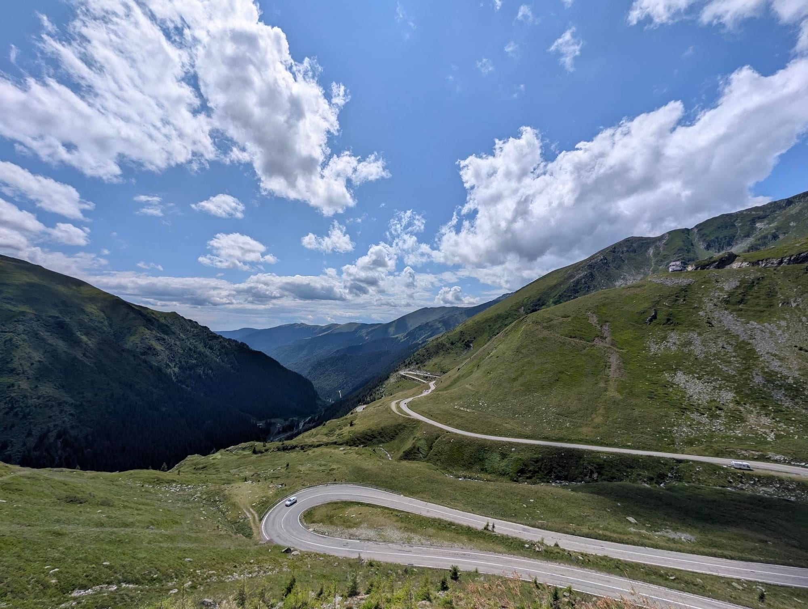
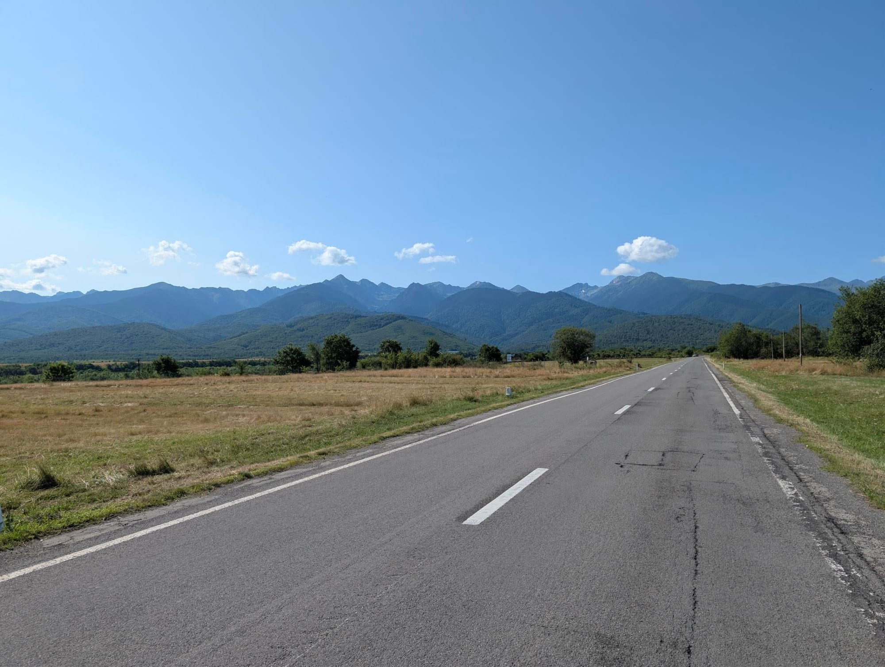

## Leg 1: Rotterdam to Romania

### Hairdryer in effect

_27 June 2026_

Germany! Garmin update mid ride, which I asked it not to do, seems to have mangled the map 😒. Was a mostly nice day, but the heat kept building until it was nearly impossible to make much progress with constant stops for hydration and cooldowns

### Less heat, but still oppressive

_28 June 2026_

Big river though 😮 Was a struggle today too. Perhaps easier due to not quite cycling on the surface of the sun, but 130 miles from yesterday were felt. Big Japan vibes with tree covered hills, so excited for more when the weather is better!

### Rhine doesn't disappoint

_29 June 2026_

Left a bit later to avoid some nasty showers in the morning, to then be greeted with ~21° cloudy weather and a tailwind most of the way - perfection.

It didn't last the whole day, but the worst was 31° which felt lovely compared to the previous heatwave days.

Rhine was a real treat! Absolutely stunning at times. Even leaving it was treated to some insanely lovely and peaceful paths ☺️

2 more days till rest day!

### Keeping it country, in before the hail

_30 June 2026_

No epic rivers today, but lots of lovely towns and villages in-between some lovely cycle paths through the farm land.

A few "climbs" today: the first made awkward by road works, so a bit of walking. The second just a gradual rise for a long time, until some nice chill sweeping descents.

Starting to look forward to the rest day 😂 Legs felt mostly fresh still today though!

### First stretch done!

_1 July 2026_

Well earn rest day tomorrow 😄

Mostly an uneventful day: it rained last night so much welcome cooler weather. Leaving a bit later meant I dodged any showers outside of some spitting.

Mostly just peaceful forests and sleepy villages today. So not much to record video wise, but a lovely day for just chilling and reflection, always good to have ☺️

### Perfect weather and roads

_3 July 2026_

Will be a day hard to beat! While the Netherlands has Germany surely beat on the quality of cycle lanes, Germany is still incredible + it has hills!

Thankful for the tailwind though, as a duo of long days coming up

### Austria!

_4 July 2026_

Another big day, but mostly downhill + tailwind 😄

Rivers + hills is certainly a stunning combination, might be up there with the best cycle paths in the world (plenty busy enough to suggest I'm not the only one that thinks so!)

Added an extra climb as a bonus side mission, was well worth it for some epic views!

### Vienna!

_5 July 2026_

Tough day with so many big miles back to back in the legs, but thankfully dodged most of the rain!

Made a bit of a planning issue by going down a semi-main road for so long 😅 But only a handful of poor overtakes thankfully. Also got some kinda nice views from that road!

Topped off with the best schnitzel 🥲

Well earned rest day now, I heard the coffee here is good 🧐

### Slovakia!

_7 July 2026_

Very short one today. Need to pop into a PC cafe to update my maps as routing is pretty crap on the Garmin at the moment!

Kinda fun just going down the road to reach another capital city!

### Hungary for Budapest!

_8 July 2026_

Little bit of rain at the start, but an impressive tailwind under a cloudy sky did not disappoint! Could practically freewheel (not that I did, a long day ahead 😄)

Some lovely views coming into Budapest but an absolutely hateful road (who planned this route!?) so didn't get to enjoy it all too much. Put in a good shift to get it off the road quickly though 😂

Still! Kinda cool hitting 3 capital cities in 2 days by bicycle 😄

### The Great Hungarian Plains

_10 July 2026_

Outside of some delightfully shite road surface that makes Northern Irish roads seems a thing of beauty, was mostly an uneventful day though the heartland of Hungary!

I am glad to get out of Budapest though, for all the delights of a big city with some fabulous buildings, just too many bloody tourists (he says, as one 😉). It was nice to see some proper Hungarian towns too, a nice quiet vibe.

AC in the room will be appreciated too 😄

### Romania!

_11 July 2026_

Exciting stuff!

Looking forward to seeing some hills again 😄 Hungary was relatively chill (not weather wise... 🥵), but flat as the Netherlands minus the great cycle paths. Though it did surprise sometimes with good lanes.

Arad certainly has some interesting cycle lanes, similar to Belfast, can better be described as "One Dimensional Car Parks", but better than nothing!

Hopefully "Best Country" delivers though, excited to see 🙂 Just hopefully not too many bears!

### No vampires yet!

_12 July 2026_

But plenty of gravel 😅 Mostly the roads were actually top tier: very quiet and generally good condition, but, in order to avoid trucks, I did include some light gravel. Though some of it turned out to not be so light 😂 Destroyed my poor Insta360 selfie stick thing so need to get a replacement as it is a bit crap without it!

The wee Romanian villages had a somewhat quiet, beautiful, but beaten up look to them. Perhaps amplified as it is a Sunday but there was an odd quietness and solemn feeling. People just slowly making there way to or from their local church. The building with some kind of mixture of what you would think of a wild west kind of style and Italian - often beautiful even when kind of falling apart or abandoned (though mostly not).

Some gorgeous views for sure, shame I couldn't capture too much in the second half due to exploding camera stick thing!

Just one more short day until this leg is complete 🙂

### Alba Iulia! Rotterdam to Romania complete!

_13 July 2026_

Stunning quiet roads (well mostly) and some fantastic views, great way to end this leg!

Will be glad for a bit of rest, but also excited to be exploring those hill in the distance next week 🙂 No bears or vampires yet, but plenty of dogs willing to give chase 😂

An excellent leg overall, perhaps a bit rushed distance / time wise - but made for a great challenge with enough stops and sights littered inbetween. Also proved I can do back to back big mile days if I need to!

## Leg 2: Alba Iulia to Bucharest

### Baby hill before the big hill

_22 July 2026_

Very nice to be out cycling again, and better yet up a big hill 😍

Weather felt very much like Ireland today: a bit colder a wee bit damp. However, after the initial stretch on a busy enough road, had some stunning views and beautiful little towns.

Looking forward to tomorrow though! Now where did I leave that bear spray...?

### Big hill

_23 July 2026_

Probably up there with the best day cycling I've ever had.

Started the day climbing a hill opposite in some epic mist, only for the challenge ahead to reveal itself.

Only after being chased by a pack (6?) pretty aggressive sheep dogs 😂

A toodle down the main road and I turn to see this goliath come ever closer.

The climb itself is kind of two parts: a forest area where the bears likely roam, and then an epic vista opens up. Hard to really capture it.

After a pretty "fun" transition through a, fairly well light, tunnel. I pop out the other side to be treated with an amazing descent, pretty free from cars!

Tonight a wee stay in a cabin in the hills, only to tackle a lake known for a few more bears 🙂 Bear count: 1

### Every hill has a downside

_24 July 2026_

No bears! I must request a refund...

The start of the day was pretty chilly descending from the hill, but what an epic place to wake up in 😄

I was prepared for today to be a bit hairy, literally, as the lake is where a lot of the bears typically are spotted, but I didn't see any! Stayed on my toes the whole time too. Half disappointed, but also half relieved 🙂

Interestingly I could taste how poor the air quality became as I reached civilization 😂 But perhaps that is also due to it being a warmer day as well.

A fairly enjoyable cycle though some holling hills and then a lot of nice easy downhill, only to finish on a pretty sketchy roundabout (which I should have recorded!)

A longer, but probably pretty easy day tomorrow!

### Alba Iulia to Bucharest complete!

_25 July 2026_

Second leg of the trip down, Romania is some place for cycling. Not that it isn't a bit dodgy at times with some (though surprisingly not many) crappy roads, and some pretty bad overtakes (sometimes from the oncoming traffic 😱), but overall some incredible roads, scenery, and generally great drivers. Will be back!

Today was generally a pretty relaxed day, lovely weather on mostly quiet roads just plodding through village after village. Heat Did get to me near the end of the cycle. Did see quite a few big, ornate houses with a fancy façade and hardly anything inside but a room or two 😄

Will be a week off, then onto leg 3 of this trip!

## Leg 3: Bucharest to Vienna

### Chill train, oven city

_30 July 2026_

Wee scoot about before check-in. Insanely hot weather 🫠

## Leg 4: Vienna to Geneva

### Up! Up! Up!

_1 August 2026_

So begins the hardest leg of this trip, perhaps the hardest leg of any trip 😅 Self inflicted damage though as I did plan it after all 😄

So far Austria has very much delivered! Some absolutely incredible views of the hills, and it's just getting started! The absolute silence of some of the roads / towns is amazing, especially in contrast to just spending some time in Vienna.

Also had a pretty epic moment of one of the climbs having a theme tune of rain, thunder, and lightning. Thankfully the lightning did not decide to light me up for the rest of my life, if you know what I mean 😅

Excited for what comes next, as it is promising to be even better!

### Ain't no Mournes, but it'll do~

_2 August 2026_

Who am I kidding, I'll never look at the baby Mourne Mountains the same way again 🥲

Absolutely epic day, the views are practically impossible to describe, and obviously pictures and video don't come close to doing the justice.

Editing the insta360 videos I can just see my face like 😮 the entire time 😂

Hard day regardless, like cycling though the Devil's wet fart it was so hot and humid. Will be glad of the rest day 😄

### Austria, where mountains have mountains ontop

_4 August 2026_

This is in reference to finishing a pretty long and epic category 1 climb, only to see a mountain still kinda of looming over me 😄 Crazy scenery.

Today, while a bit less epic on the views compared to the second day, certainly delivered on some incredible roads / lanes / cycle paths.

Was a very tough day. Not just because of the distance and elevation, but the heat was brutal and relentless. Basically just sitting around 40° after 12:00. I'm glad I left early for a change to avoid a good chunk of it! Not even the queen stage too, that is yet to come 😅

### Innsbruck? No, ins broke!

_5 August 2026_

An eventful morning.

Was going grand but then when I was freewheeling there was a grinding sound coming from the bike and could even feel the grinding through the pedals. I kinda thought "that ain't good", but as is often the case I thought it might be ok.

Then it kinda got worse and worse: chain dropping, chain kinda sticking, horrible noise. So naturally I googled it as well, which confirmed it is "dangerous to continue" on 😅

So went round to a wee bike shop and as I rock up the owner is coming out for a smoke and kinda half laughs at the noise of my bike.

Straight into it! Cassette / free hub off. Thing inspected and bearings seem fine, but totally bone dry inside, no grease at all. So a good bit of greasing and carefully putting it back together and it's golden again!

The dude wouldn't even take any money for it, just kept saying "have a good trip" 🥹 What a hero.

After that an incredible day. Full of some fantastic views and paths like yesterday, and some brutal but thankfully short climbs (saw 29% gradient on the Garmin, surely not right 🫣)

Still hot as feck though.

### Switzerland, with a side order of Liechtenstein!

_6 August 2026_

3rd day in a row of tasty climbs, was certainly feeling it!

Started with a ramp from mile 0 today, so just up and up until hitting a height of 1800m (~6000ft). Thankfully there was a cafe at the top 😅 Was struggling even in my generous 40t/51t gear setup! Also very glad clouds hit today, doing those climbs in 40° heat might have killed me 😭

Some amazing views with the clouds hugging the hills today, nearly makes them feel more massive!

Well deserved rest day before some of the likely hardest days of the trip 😮‍💨

### The Queen Stage

_8 August 2026_

Some serious climbing today, but Christ almighty some amazing views.

Was a bit of double damage: two mountain passes I had to scale.

The first being the "easier" of the two, but was still a solid test. It on it's own would have made for a difficult ride!

But there was another. Much longer, and honestly more impressive views wise! It did feel like it went on forever, but I only put the foot down once as I think I might have been taking the piss to keep going to the top 😅 It ended with probably the most enjoyable descent I've ever had! Crazy good road.

Both climbs did have an issue with loads of traffic, but you do kind of zone it out after a while - most cars are respectful. Most 😂

The last 20 miles, while being a mostly nice downhill, were brutal due to the sun. The road had plenty of time to bake, and had a hairdryer headwind. So assaulted from all angles!

Climbing ain't over yet too 😄

### France!

_9 August 2026_

At least for one night anyway 😂 But what an epic way to get there!

The day started proper with a decision: do I include a bit of a spicy bonus climb to avoid traffic? It didn't seem super busy on a Sunday... but when in Rome 😅 It certainly delivered! Was very steep and hard work on tired legs, but relatively quiet ascent and an amazing descent! Totally worth it 😄

The middle of today was mostly a gentle downhill in some toasty weather, soaking up the valley views.

The end, well it was a pair of very long tasty climbs. Separated by an incredible valley. I would have certainly enjoyed them more, but the huge amount of traffic does kinda of deflate them somewhat - can't really relax as you are always on edge for crap overtakes or just the intense noise of a group of motorbikes flying by you way too fast. Still, totally worth it 😄

The day ended by some pretty amazing views of Mont Blanc as I rolled into France. Shame I'm only spending one night here!

### Vienna to Geneva complete!

_10 August 2026_

A likely unbeatable leg of any cycle trip, will be hard to beat the Alps!

A lovely descent out of Chamonix (need to come back to do it as an ascent some time!), and then mostly just cruising the whole day. The sun did start to bake (hit 40° again...) which always makes it brutal, but thankful for a shorter day regardless.

Few well deserved days of rest until the next leg of this journey.

The Alps will be missed 🥲

## Leg 5: Geneva to Cherbourg

### La jambe française

_14 August 2026_

So the French leg begins!

Started with a nice cruise to the last big climb of the trip, waving goodbye to tall hills. All was well on the climb until I started hearing thunder that sounded rather close... Turned a nice steady climb into a wash out 😅 Thankfully was near the top with a restaurant to hide in! Would 100% not want to be descending in that!

After the rain passed I was treated to an amazing view of a valley. Stopped at a "viewpoint restaurant" and asked for a "big coke" (after doing the "Bonjour, l'anglais?" handshake 😄), but they misunderstood this and served me a beer. Only in France 😄

After coming out of the valley the sun was in full force. Basically 60 miles of ~40° heat which was less than ideal. I'm sure there was nice scenery to look at but tbh I was just in survival mode cycling between water stops, too brutal!

Hopefully the heatwave waves goodbye soon...

### Nevers again

_15 August 2026_

Imagine the feeling: pretty much out of water in 42° heat after 2 hours since your last shop stop, but a shop is close and Google maps promises it'll be open! Even the side of the shop has opening hours pasted on it for you to see as you rock up, a second promise! You gingerly park the bike, in anticipation of a cold beverage. Only for the door to be locked, the lights out, and the next shop over an hour away!

Fear not, sure there is drinking water at every church! Well of the two along this stretch of road, all they produced was lies 😂 I love heatwaves 🥲

To give real vibes, was a fantastic wee morning. The sun wasn't quite at maximum death rays, and the cycle paths were plenty and lovely. I was starting to believe this would be the entire day! Even had a pretty cool (literally as well) cyclists only tunnel.

It was only the last, ehh, 70 mile or so that was in "feck you" weather 😂

Basically a lot of long empty roads, with no shade, no shops, and a lovely hairdryer headwind to both slow and sap energy. So a tough auld cycle 🙂😭 Many a "this is a feckin' ridiculous" were muttered I'll tell yah 😄

But, a room with the rare addition of air conditioning, plus after a wonder shower (there should be a word for that feeling when cool water hits your head on a hot day), I can kind of laugh at a day like that 😄 To be fair would have been a perfect route in more agreeable weather.

Pun was essential.

### Sky pillows

_16 August 2026_

Never been so happy to see a cloudy day!

Much more manageable heat wise. Even had one short but fairly heavy bit of rain, and a shorter light rain. Both very manageable and actually kinda of refreshing! Irish people must need a rainy recharge every so often...

Overall some lovely quiet easy roads. Very little traffic, and sufficient number of shops in-between 😄 France during holidays season has some advantages!

Welcome rest day tomorrow~

### Actually ☝️🤓, it's Le Men

_18 August 2026_

Had to chuck a tube in the rear wheel this morning!

Generally had an issue were the rear tyre had a bit less air every morning, but an easy top up. So did the same today but awkwardly unscrewed the valve core so the tyre went flat. On trying to pump up it just wouldn't hold air! So in goes a tube. Did see some of the tubeless tape lifting a bit, and water coming out through the spokes when trying to revive the tubeless, so I guess the tape was knackered and the lack of pressure kind of killed it off. Better to happen when I'm not moving!

Overall the day was pretty chill. Slow progress due to a consistent 15mph headwind, but just settled in as if it was a long climb. Thankfully weather was near enough perfect. Very peaceful and quiet country roads. Not exciting for pictures but relaxing to cycle.

Just had a slight planning issue meaning the first 60 miles had no shops, so took a slight detour 40 miles in to get some food etc, worked out as a smart idea!

And yes, terrible pun 😄 Exciting bed setup though 😂

### Rolling French hills

_20 August 2026_

Not too dissimilar to Ireland. Just nice quiet side roads and rolling hills. Just most places still closed so not much refueling.

Not a whole lot to look at, but that is relaxing and nice in it's own way. Strong headwind again most of the way, but another case of just settling in.

~25° all day was a joy too, pretty perfect cycling weather minus the headwind!

### Geneva to Cherbourg complete!

_21 August 2026_

Not the most exciting of legs, but nice to finally cycle through France properly!

Was tough though: big miles, rolling hills, oppressive heat, and pretty much a headwind every single day. Legs are certainly feeling it!

But, the stereotype of French people being difficult isn't really true at all. Everyone was lovely! Had great interactions even with my mostly absent French. Just gotta scream Bonjour! when you enter most places, and ask if English is ok before stampeding into it 😄 Funny how being polite is often returned...

Sadly today's ride also left the bike a bit worse for wear... There was a stretch over some very light gravel trails, which would have been fine, except it decided to rain at the same time. So the bike is totally caked in sand! I did try to get it cleaned but obviously nothing open / no car washes. Will have to see tomorrow. Got the chain kinda of cleaned so maybe ok.

Just a ferry and one more day of cycling until this adventure is complete 🥲

### Attempt to find somewhere to wash the bike

_21 August 2026_

Mostly failure

## Leg 7: Dublin to Belfast

### Dublin to Belfast to complete, and "FT" complete too!

_23 August 2026_

Hard to put into words the entire trip, will have to kind of decompress over the next few days weeks 😄 Just over 3000 miles, during 33 days of cycling, on a ~23kg bicycle is a lot!

Looking at the entire map it just seems mental in hindsight. Also cruising the last mile down familiar roads that I have ended so many cycles on. This is "just another cycle" but really isn't, and I'll need to let that dawn on me 😅

A fantastic way to end the trip too, got a lovely tow from Cesare Carcano and James McGrann most of the way home. I've missed a draft 😄

I'll let you decide what "FT" means 🙂

It's good to be home.
