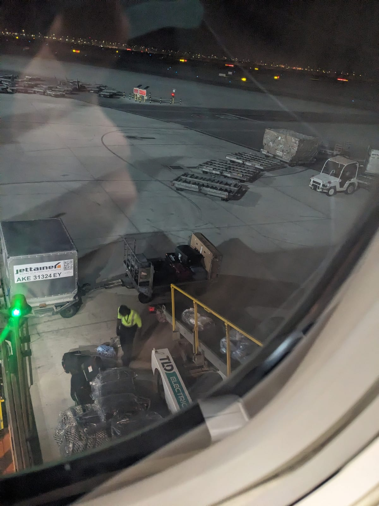
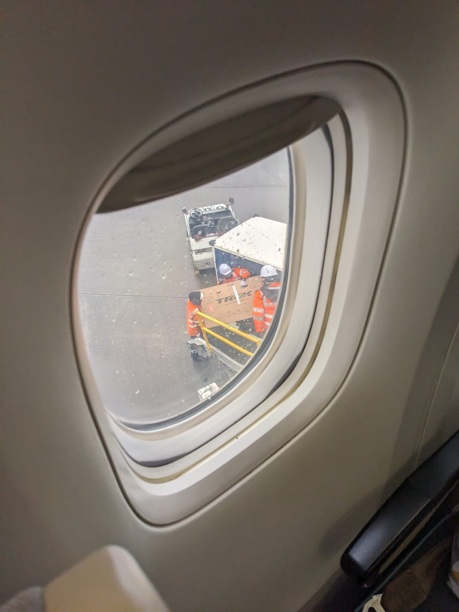
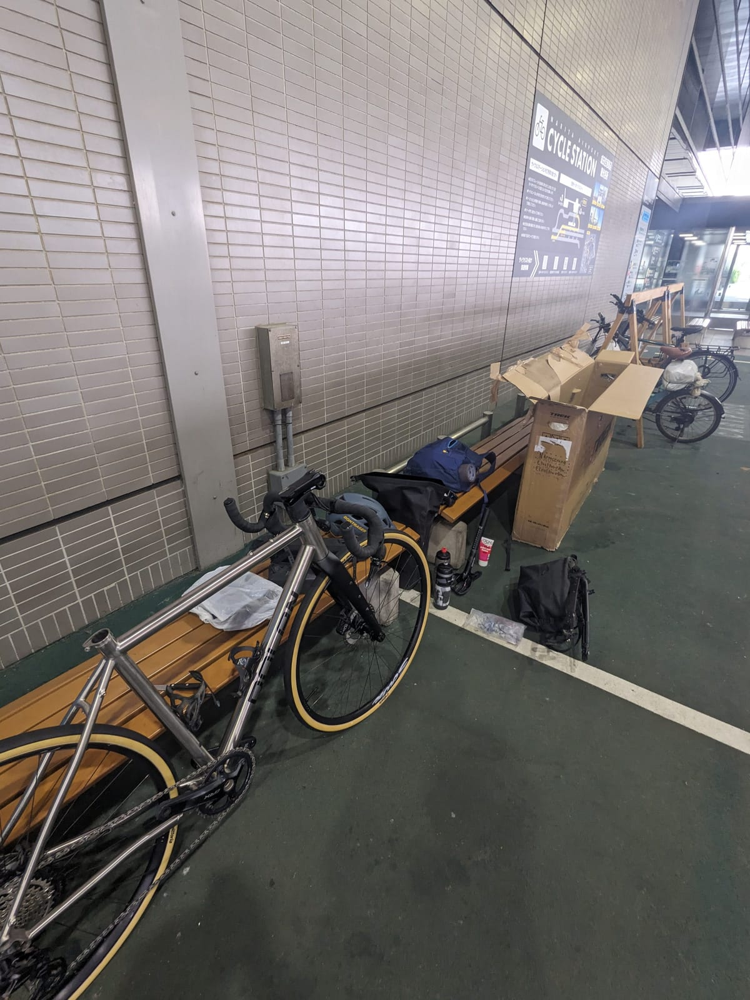
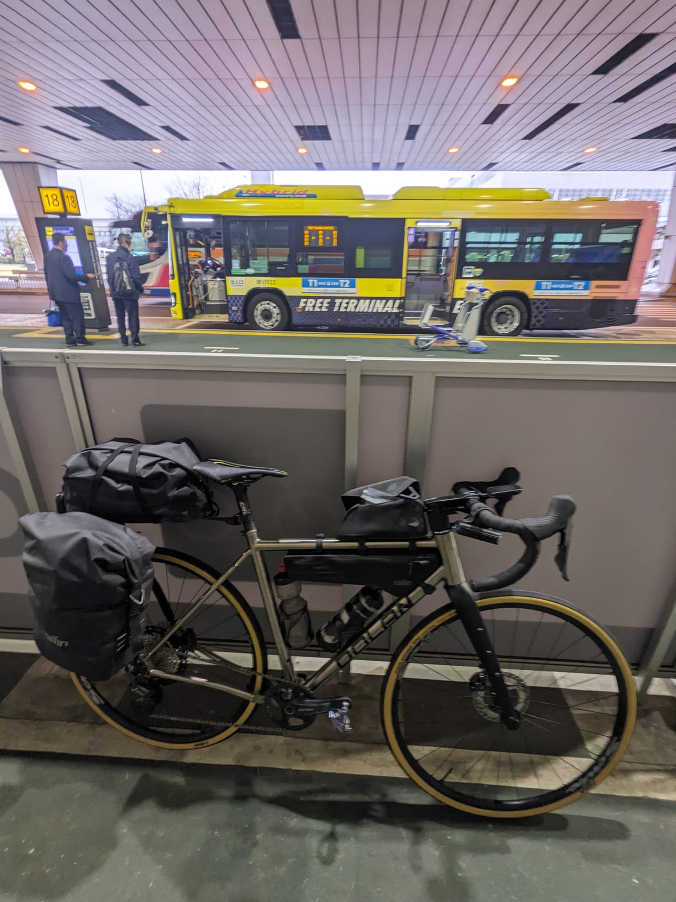
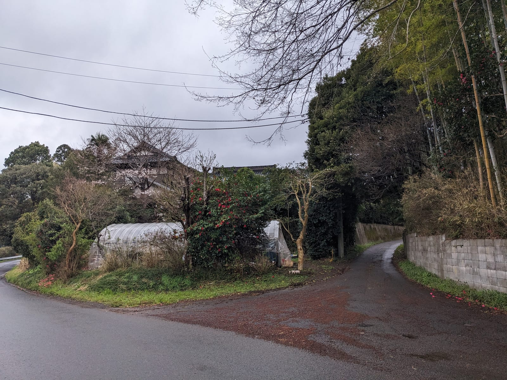
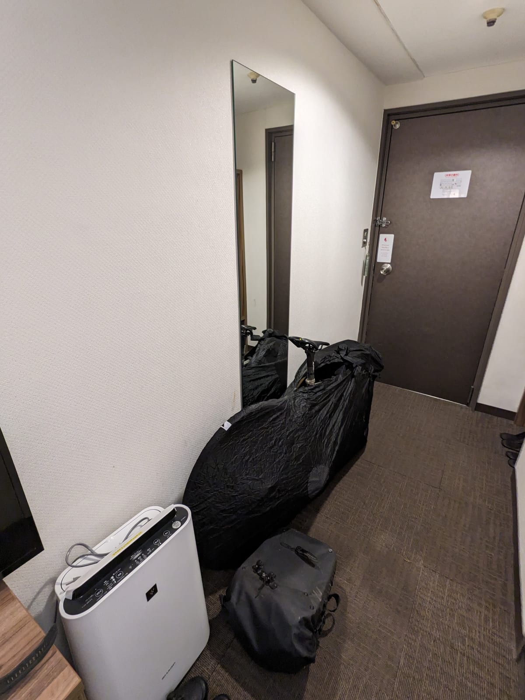
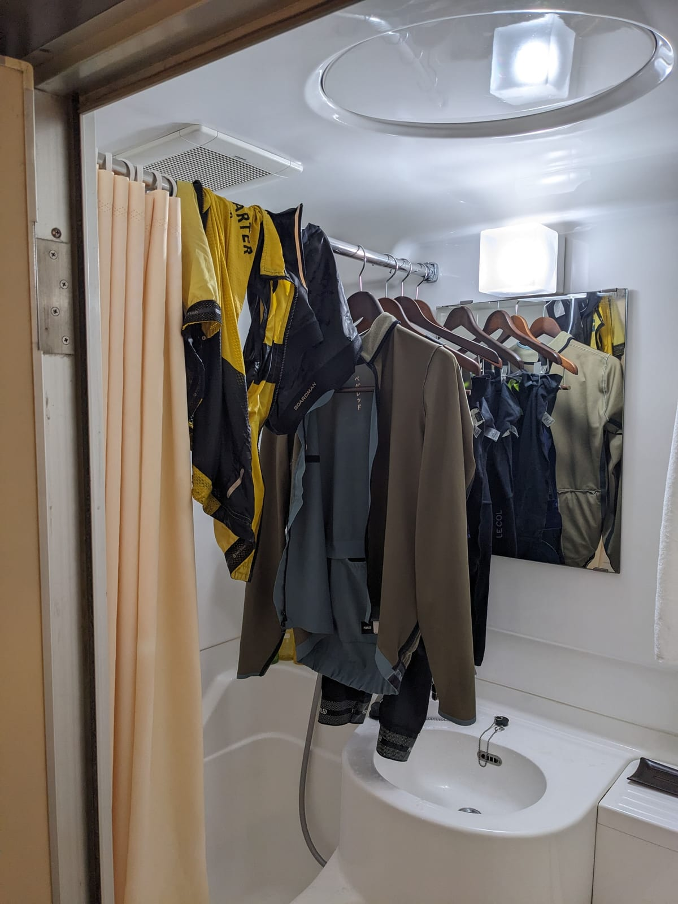
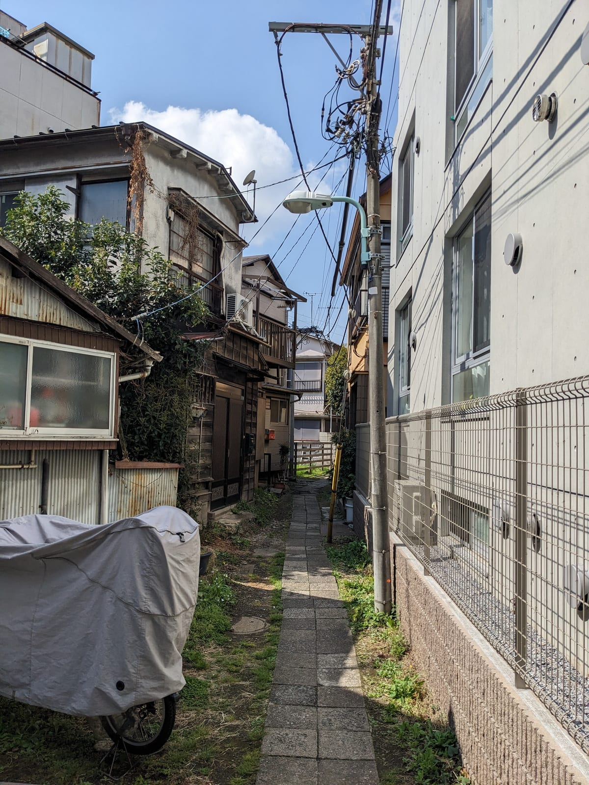
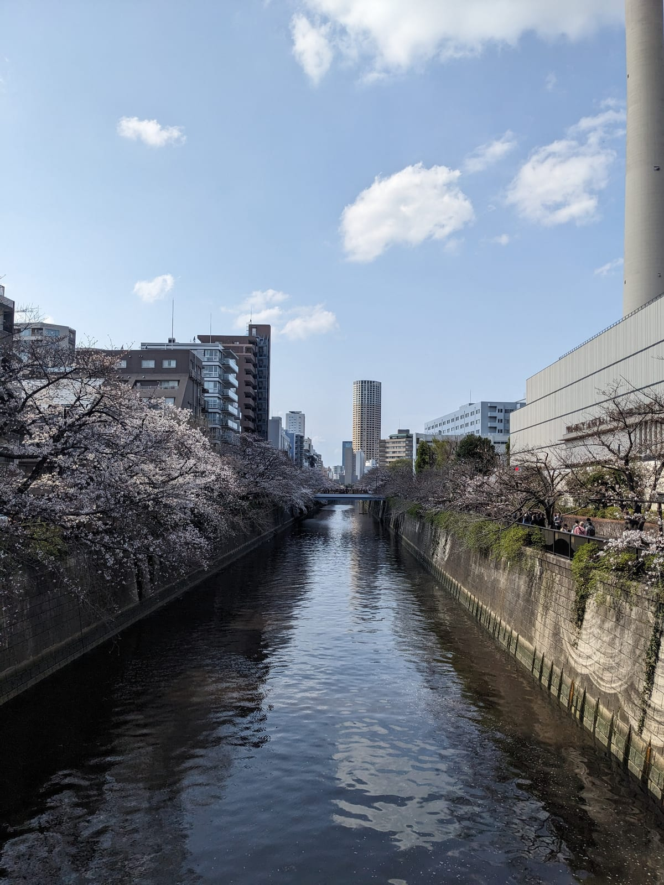
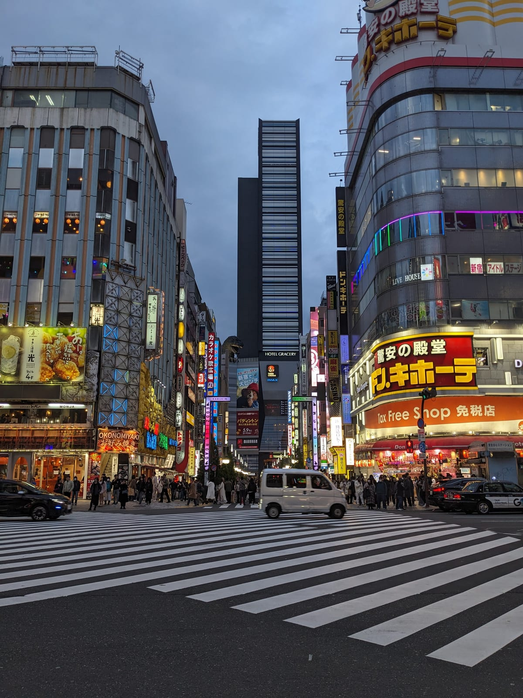

This was a plan seeded in my mind during my first trip: if that goes well, I wonder could I cycle from Tokyo to Seoul? After a lot of draft planning, and thinking through how I'd pull it off, I was fortunate enough to get a month's paid leave from work to put it into action.

It began with the literal day after a stag do in Rome: Fly back to Dublin, stay overnight at an airport hotel, and straight back on a plane with my bike to cycle from Tokyo to Seoul. This trip was a massive challenge logistically, not just from the daunting distance and fitness requirements. Flying to the other side of the world with connections in the middle, twenty hours of travel time, and hoping and praying the bike survived.

(Coming soon: a post about how I plan my trips. TL;DR: I plan the entire route beforehand: all the hotels, the routes, the distance per day, the rest days. So when I arrive, all I really need to do is cycle 🙂)

## Rome to Tokyo, via a bike box

On the flights I didn't get a huge amount of sleep - I never really sleep on flights. Though I did get visual confirmation, landing at both the midpoint in Abu Dhabi and in Tokyo, that the box was looking intact. The airport staff were laughing about how to carry the awkward shape.

## Building the bike in the airport

In a sleep-deprived state, I decided I should build the bike up in Narita Airport and cycle to Tokyo, to my hotel. I'm not sure if you know, but Narita is nowhere near Tokyo, even if it's sometimes called a "Tokyo airport". But sure, cycling can take you long distances 🙂

While I was tired enough that I felt like I was cycling slightly drunk, it was totally worth it. Instantly I had that "pinch me, I'm dreaming" feeling, actually doing this cycle I'd spent so much time planning and training for. It's pretty obvious in my first video, which shows very little at all, but I'm more just like "wow, I'm actually here…"

It didn't take me long to see some very Japanese views, though.

I had my first taste of conbini food and Japanese roads and drivers. So far so good. Before the trip I'd also done the research to know I'd need something called a "rinko bag" in some hotels, but also on all trains and buses. After a good bit of research I found a really nice bag, not cheap, that worked extremely well ([the Fairmean gravel cycling rinko bag](https://www.fairmean.com/gravel-cycling-rinko-bag/p/product-6jwdz)). The first hotel, I had to deploy it and everything. Thankfully I'd practised a little before the trip.

The advantage of this bag is you don't need to take off the saddle or handlebars. So while it's a bit longer than most bags, it's super fast to pack and unpack, and the bag itself packs down very small. Still going strong even today.

While bikepacking is a joy, there's some logistics to take care of, like cleaning your kit and then hoping it's dry the next day. So this kind of sight becomes pretty common:

## A day in Tokyo

I had a single day off in Tokyo (a month off work is long, but not that long!) just in case there were any bike issues. Thankfully my cycle from the airport into Tokyo was enough to prove out the bike, so I could mostly relax. I did go to a bike shop for some thicker gloves, though, once I realised the weather was a good bit colder than I'd expected. Can plan everything but the weather, eh? As expected, Tokyo had some amazing sights, even for a single day of just plodding around.

